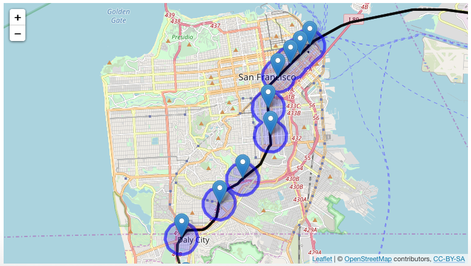
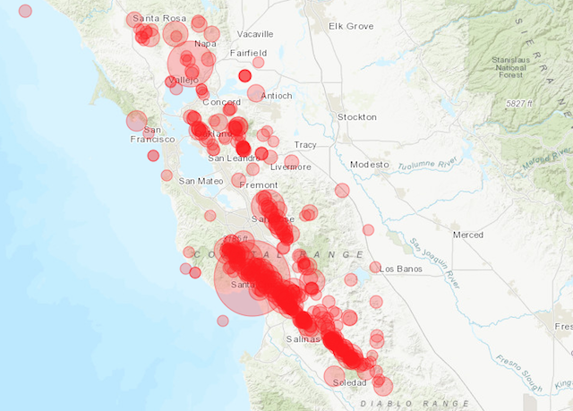
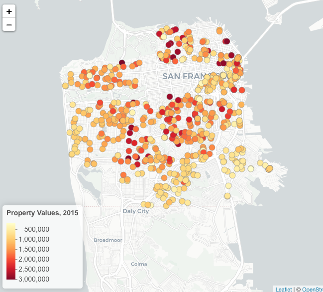
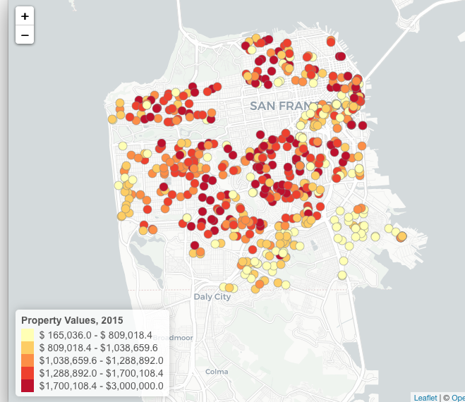
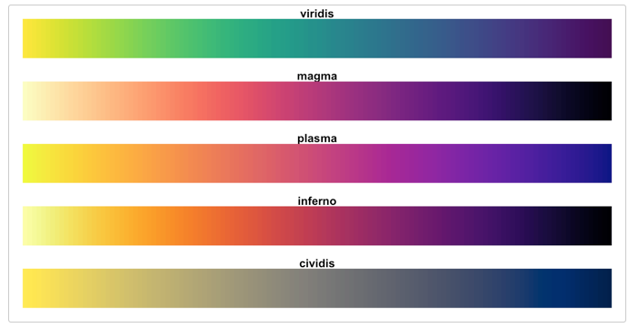
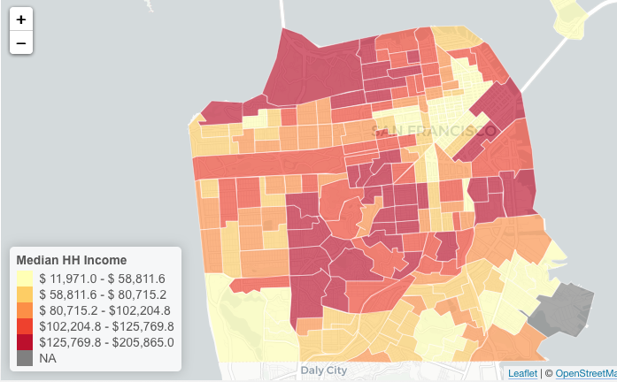
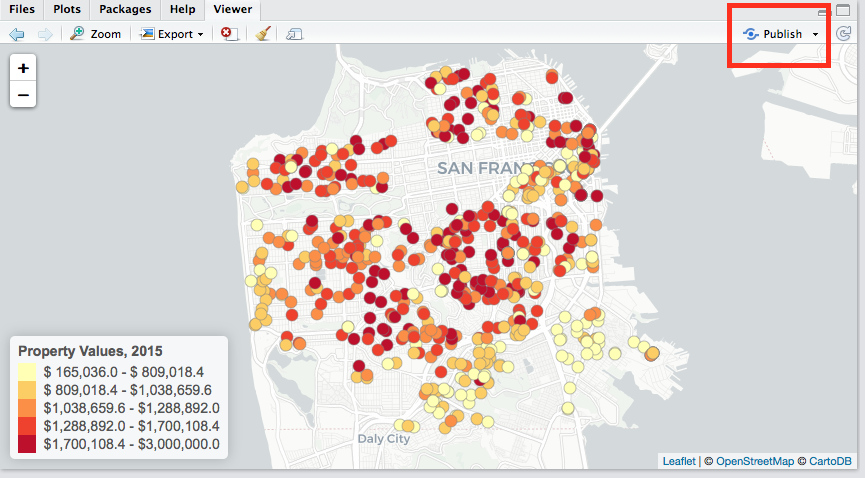
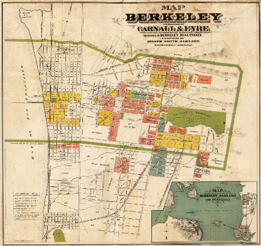

```{r setup, include=FALSE}
knitr::opts_chunk$set(echo = TRUE)
```

## WebMaps in R with Leaflet

Welcome! While we're waiting:

* Please download the workshop files from: [https://github.com/dlab-geo/r-leaflet-workshop](https://github.com/dlab-geo/r-leaflet-workshop)
   
* Unzip the Zipfile: [https://github.com/dlab-geo/r-leaflet-workshop/archive/master.zip](https://github.com/dlab-geo/r-leaflet-workshop/archive/master.zip)

* Open RStudio

* Open a new R script file


## Workshop Outline

**Introductions**

####**Basic Maps**

* Marker Maps
* Adding Popups

####**Data Maps**

* Symbology for mapping point data
* Choropleth maps
* Adding Legends

####**Doing More**

* Customizing the UI
* Sharing your maps

# Leaflet

## Leaflet

[Leaflet](http://leafletjs.com/) is a lightweight, yet powerful javascript library for creating interactive web maps.

</img>

Leaflet maps are a combination of **HTML** and **Javascript** code that is meant to be rendered in a web browser.

You can use the R **leaflet** package to create Leaflet maps in R without knowing HTML and Javascript!

## Leaflet in R Workflow

1. Find the geospatial data that you want to map.
2. Use the `leaflet` R package to make a custom, interactive map of your data.
3. Save your leaflet map to an `html` file.
4. View your html file locally in your web browser.
4. Share your map by emailing the html file or hosting it on a website.

## Why the package `leaflet`?

There are a number of R packages for making Leaflet maps.

- **leaflet** is actively maintained, highly customizable, and integrates well with other R libraries.

- **tmap** is easier for getting started *but less customizeable*
    - also great for interactive data analysis
    - also great for static maps (similar to ggplot2)

- *tmap may be a better option for some folks!*
    - we cover it in our `Geospatial Data in R` workshop series.

## Getting Started

Download workshop files: [https://github.com/dlab-geo/r-leaflet-workshop](https://github.com/dlab-geo/r-leaflet-workshop)

Follow along:

* *Tutorial Page* (leaflet-webmaps-in-R.html)
* *Raw code* (leaflet-webmaps-in-R.R)
* *Slides* (leaflet-webmaps-in-R-slides.html)

*Make sure you can copy and paste from one of the above into the script.*


```{r global_options, include=FALSE}
knitr::opts_chunk$set(fig.width=8, echo=TRUE, warning=FALSE, message=FALSE)
```

## Load R Packages

Load the packages we will use today

```{r, message=FALSE, warning=FALSE}
library(leaflet)
library(RColorBrewer)
library(sp)
library(rgdal)
library(htmlwidgets)
library(dplyr)
```

*Install any packages that you do not have on your computer*

## Set working directory

to the folder in which you unzipped the workshop files

</img>


# Our First Leaflet Map

## Our first Leaflet map
```{r,eval=F}
map1 <- leaflet()       # Initialize the leaflet map object
map1 <- addTiles(map1)  # Add basemap - default is OpenStreetMap
map1                    # Display the map
```

**WARNING** don't call your map object `map`

## Our first Leaflet map

```{r}
map1 <- leaflet()       # Initialize the leaflet map object
map1 <- addTiles(map1)  # Add basemap - default is OpenStreetMap
map1                    # Display the map

```                  

## Piping Syntax

Its very common use `piping` or `chaining` syntax....

The output of one command becomes the input of the next command.
```{r, eval=F}

map1 <- leaflet() %>%    # Initialize the leaflet map object
        addTiles()       # Add basemap - default is OpenStreetMap

map1                     # Display the map  
```


## Setting the Map's Intial View

Use **setView** to specify the `center` of the map and the initial `zoom` level.

```{r, message=FALSE, results="hide"}
map1 <- leaflet() %>%
        addTiles() %>%  
        setView(lat=37.87004, lng=-122.25817, zoom = 15)
map1  
```

## Setting the view
```{r}
map1  # setView(lat=37.87004, lng=-122.25817, zoom = 15)
```


## Challenge

Create a leaflet map centered on San Francisco with an intial zoom level of 14.

- You can get the coordinates by right clicking in Google Maps and selecting **what's here**


**Questions**

- What zoom level shows all of the city without much more?

- What is the max possible zoom level?

## Challenge - Solution

The maximum zoom level is 18
```{r}
leaflet() %>%  
  addTiles() %>%  
  setView(lat=37.76175, lng=-122.4470, zoom = 12)
```

## Maximum Control

How does this code limit the map?
```{r}
map1 <- leaflet(options=leafletOptions(minZoom=15, maxZoom=18)) %>%
  addTiles() %>%  
  setView(lat=37.87004, lng=-122.25817, zoom = 16) %>%
  setMaxBounds(-122.2570, 37.866458, -122.2553,37.877167)
map1 
```

## Basemaps

By default, Leaflet uses the [OpenStreetMap](https://www.openstreetmap.org/#map=5/38.007/-95.844) basemap, which is added with the `addTiles()` function
```{r, message=F}
leaflet() %>% addTiles() %>% 
           setView(lat=37.870, lng=-122.258, zoom = 15)
```


## addProviderTiles

Use `addProviderTiles` with the name of the `basemap` to add a different basemap.

Create a leaflet map with the `ESRI World Street Map` basemap.

```{r}
map2 <- leaflet() %>%
        addProviderTiles("Esri.WorldStreetMap") %>% 
        setView(lat=37.870044, lng=-122.258169, zoom = 12)
 
```


## View it

```{r}
map2   #Using ESRI WorldStreetMap basemap
```

## Specify a Basemap

Add a different basemap by taking a look at this web page of available basemaps

[http://leaflet-extras.github.io/leaflet-providers/preview/](http://leaflet-extras.github.io/leaflet-providers/preview/)

Use the `provider name` in quotes to access the basemap.

## CartoDB Positron Basemap

```{r}
leaflet() %>% addProviderTiles("CartoDB.Positron") %>% 
    setView(lat=37.870044, lng=-122.258169, zoom = 12)
```

## Getting Help

For more info, read the documentation  

```{r, eval=F}
?addProviderTiles
```


# Mapping Data

## Mapping Data

</img>


## Map Point Data with Markers

**Barrows Hall**, longitude=-122.25817, latitude=37.87004

```{r, echo=F}
map3 <- leaflet() %>%
  addTiles() %>%  # Add default OpenStreetMap map tiles
  #setView(lat=37.870044, lng=-122.258169, zoom = 17) %>%
  addMarkers(lat=37.87004, lng=-122.25817, popup="Barrows Hall")
map3

```

## addMarkers

Use `addMarkers` to add one or more data points to the map.

```{r, eval=F}
map3 <- leaflet() %>%
  addTiles() %>%
  addMarkers(lat=37.87004, lng=-122.25817, popup="Barrows Hall")
map3
```

## addMarkers

Markers show location and a little information
```{r, echo=FALSE}
map3 <- leaflet() %>%
  addTiles() %>%
  addMarkers(lat=37.870044, lng=-122.258169, popup="Barrows Hall")
map3
```


## Review the Code

```{r, eval=F}
map3 <- leaflet() %>%
  addTiles() %>%
  #setView(lat=37.870044, lng=-122.258169, zoom = 17) %>%
  addMarkers(lat=37.87004, lng=-122.25817, popup="Barrows Hall")
map3
```

- You don't need to use `setView` (commented out).

- The map will automatically center on the marker data and determine the zoom level.

- But, you can override this with `setView`.

- *What does `popup=` do?*


## addMarkers Documentation

You can always check the function documentation to see your options!

`?addMarkers`


## Challenge

How would you add a second marker for Cafe Milano?

- 37.868641, -122.258537

- Try it?

## Two Markers

```{r}
map3 <- leaflet() %>%
  addTiles() %>%
  addMarkers(lat=37.87004, lng=-122.25817, popup="Barrows Hall") %>%
  addMarkers(lat=37.86850, lng=-122.25830, popup="Cafe Milano")
map3
```

## Two Markers - another way

```{r}
map3 <- leaflet() %>%
  addTiles() %>%
  addMarkers(lat = c(37.87004,37.86850), 
             lng = c(-122.25817,-122.25830),
             popup = c("Go Bears", "Cafe Milano"))

map3
```


# Questions?
 

# Mapping Data Frames

## Bart Stations

Source: [Caltrans GIS Data](http://www.dot.ca.gov/hq/tsip/gis/datalibrary/Metadata/BART_13.html)

```{r}
bart <- read.csv('data/bart.csv', stringsAsFactors = FALSE)  
str(bart)
```

*What column(s) contain the geographic data?*

## Mapping Bart Stations as Markers

```{r, results="hide"}
map4 <- leaflet() %>%
         addTiles() %>%   
         addMarkers(lat=bart$Y, lng=bart$X, 
         popup= paste("Station:", bart$STATION))
map4
```

## Mapping Bart Stations as Markers
```{r}
map4
```

## Geographic Data Files

Point data are often stored in `CSV` files and loaded into R data frames.

These point data are manipulated like other R data frames.

Leaflet can map these data if the points use geographic coordinates (longitude & latitude).

More complex geographic data are commonly stored in `ESRI Shapefiles`.

To get the most out of spatial data in R you should use packages specifically for working with spatial data.


# Spatial Data in R

## Spatial Data in R

We can use the `sp` and `rgdal` packages to import, manipulate and map more complex spatial objects.

`sp` - **R classes and methods for spatial data**

`rgdal` - **Functions for importing and transforming spatial data**

Let's use these to import data in ESRI Shapefiles


## Read in an ESRI Shapefile

`BART Lines`

Source: [Caltrans GIS Data](http://www.dot.ca.gov/hq/tsip/gis/datalibrary/Metadata/BART_13.html)
```{r}
dir("data/BART_13/")
```

## BART Lines

Use `rgdal` to read in the data from a Shapefile

```{r}
library(rgdal)
bart_lines <- readOGR(dsn="data/BART_13",layer="BART_13")
```

## BART Lines

Take a look at the data

```{r}
summary(bart_lines)
```


## BART Lines

Use `addPolyLines` to add linear features

```{r, results="hide"}
map4 <- leaflet() %>%
         addTiles() %>%   
         addMarkers(lat=bart$Y, lng=bart$X, 
         popup= paste("Station:", bart$STATION)) %>% 
         ###<b>
         addPolylines(data=bart_lines, color="black", weight=3)
         ###</b>
map4
```

*Leaflet can map both data frames & spatial objects!*

## BART Stations & Lines
```{r}
map4

```


## BART Service Areas

Let's add BART Service Area data, a subset from the  [Metropolitan Transportation Commission (MTC)](http://opendata.mtc.ca.gov) Transit Service Area data.

```{r}
dir("data/Transit_Service_Areas_2016")
```

## BART Service Areas

Let's add BART Service Area data from the  [Metropolitan Transportation Commission (MTC)](http://opendata.mtc.ca.gov)

```{r}
bart_service <- readOGR(dsn="data/Transit_Service_Areas_2016",layer="bart_service_area")
```

## BART Service Areas

Take a look at the data

```{r}
summary(bart_service)
```


## BART Service Areas

Use `addPolygons` to add area features

```{r, results="hide"}
map4 <- leaflet() %>%
         setView(lat=37.857900, lng=-122.245156, zoom = 12) %>% 
         addTiles() %>%   
         addMarkers(lat=bart$Y, lng=bart$X, 
         popup= paste("Station:", bart$STATION)) %>%   
         addPolylines(data=bart_lines, color="black", weight=4) %>%
         ###<b>
         addPolygons(data=bart_service, color="blue", opacity = 0.6)
         ###</b>
map4
```


## BART Stations, Lines & Service Areas
```{r}
map4

```

## CHALLENGE

Redo the previous map and:

- change the basemap to "CartoDB.Positron"

- set the default view to center on San Francisco

## Challenge Solution
```{r}
map4 <- leaflet() %>%
         setView(lat=37.76175, lng=-122.4470, zoom = 12) %>%
         addProviderTiles("CartoDB.Positron") %>%   
         addMarkers(lat=bart$Y, lng=bart$X, 
         popup= paste("Station:", bart$STATION)) %>%   
         addPolylines(data=bart_lines, color="black", weight=4) %>%
         addPolygons(data=bart_service, color="blue", opacity = 0.6)

```

## Challenge Solution

```{r}
map4
```

# Questions?

## A note about working with Geospatial Data

All geospatial data are referenced to a `coordinate reference system`, or `CRS`.

- A CRS is also referred to as a `projection` or `map projection`

A discussion of `CRSs` is beyond the scope of this workshop!

- Please take our `Geospatial Data in R` workshop series to learn more.

CRSs and R Leaflet

- Leaflet package expects data to be specified in latitude and longitude coordinates and assumes the using WGS 84 (a.k.a. EPSG:4326) CRS. 

- See the [Leaflet for R tutorial](https://rstudio.github.io/leaflet/projections.html) for more information.

# Saving your maps

## Save the Map

Save the map as an HTML file that you can then open in a browser, share with friends, put online.

You will need to have the `htmlwidgets` package installed and loaded to save to HTML.

```{r}
#library(htmlwidgets)
saveWidget(map4, file="bartmap.html")
```

# Questions?


# Part II: Mapping larger datasets


## Mapping SF Property Data

[San Francisco Open Data Portal](https://data.sfgov.org)

[SF Property Tax Rolls](https://data.sfgov.org/Housing-and-Buildings/Assessor-Historical-Secured-Property-Tax-Rolls/wv5m-vpq2)

This data set includes the Office of the Assessor-Recorder’s secured property tax roll spanning from 2015.

We are using this as a proxy for home values.

We are working with a simplified version of the full data set.

## Load the CSV file into a data frame

*Set your working directory first to the folder where you downloaded the workshop files!*
```{r }
sfhomes <- read.csv('data/sfhomes15.csv', stringsAsFactors = FALSE)  
str(sfhomes)
```

## Explore the data

 
```{r }
head(sfhomes)
```

## Map the data

```{r}
map4 <- leaflet() %>%
  addTiles() %>%   
  addMarkers(lat=sfhomes$lat, lng=sfhomes$lon, 
            popup= paste("Address:", sfhomes$Address,
                         "<br>", # add line break
                         "Property Value: ", sfhomes$Value))

```

## Display the Map

```{r}
map4    
```

## Popups Made Easier

We can add to and save the popup code and re-use it instead of typing it over and over again.

```{r}
popup_content <- paste("<b>Address:</b>", sfhomes$Address,"<br>", 
                       "<b>Property Value</b>: ", sfhomes$Value, "<br>",
                       "<b>Neighborhood:</b> ", sfhomes$Neighborhood, "<br>",
                       "<b>Num Bedrooms: </b>", sfhomes$NumBeds, "<br>",
                       "<b>Num Bathrooms:</b>", sfhomes$NumBaths
                       )
```

```{r}

map4 <- leaflet() %>%
          addTiles() %>%   
          addMarkers(lat=sfhomes$lat, lng=sfhomes$lon, 
                     popup= popup_content)
```

## Customizing the Popup
```{r}
map4
```


## Shorter syntax

Instead of this:
```{r, eval=F}
leaflet() %>%  
  addTiles() %>%   
  addMarkers(lat=sfhomes$lat, lng=sfhomes$lon, popup= popup_content)
```


We can use this syntax:
```{r, eval=F}
leaflet(sfhomes) %>%
  addTiles() %>%   
  addMarkers(~lon, ~lat, popup = popup_content)
```

When the addMarkers function arguments `lng=` and `lat=` are not named they must be in the expected order (longitude, latitude)!


## Too Many Markers!

Read the `addMarker` documentation for options to address this.

```{r, eval=FALSE}

addMarkers(map, lng = NULL, lat = NULL, layerId = NULL, 
           group = NULL, icon = NULL, popup = NULL, 
           options = markerOptions(), 
           clusterOptions = NULL, clusterId = NULL, 
           data = getMapData(map))
```

## Cluster Option

```{r}
map4 <- leaflet(sfhomes) %>%
  addTiles() %>%   
  addMarkers(~lon, ~lat, popup= popup_content,
            ###<b>
            clusterOptions = 1)
            ###</b>
 
```

## Cluster Option

```{r}
map4  # Explore the Map - hover over a cluster marker, zoom in.
```


## Mapping Points as Circles

`addCircleMarker`

```{r}
map4 <- leaflet(sfhomes) %>%
  addTiles() %>%   
  addCircleMarkers(~lon, ~lat, popup = popup_content)
 
```

## Mapping Points as Circles

`addCircleMarker`

```{r}

map4 
```

## addCircleMarkers

```{r, eval=F}
addCircleMarkers(map, lng = NULL, lat = NULL, radius = 10, 
    layerId = NULL, group = NULL, stroke = TRUE, color = "#03F", 
    weight = 5, opacity = 0.5, 
    fill = TRUE, fillColor = color, ....)
```

## Customize the circleMarkers

Change color, radius and stroke weight of circle markers

```{r}
map4 <- leaflet(sfhomes) %>%
  addTiles() %>%   
  addCircleMarkers(~lon, ~lat, popup = popup_content,
             color="white", radius=6, weight=2,   # stroke
             fillColor="red",fillOpacity = 0.75   # fill
             )
```
- Use `colors()` to see a list of all R named colors.
- You can expand on these with [hexidecimal color values](http://www.color-hex.com).


## Customize the circleMarkers

```{r }
map4 
```

## Question

Can you cluster `circleMarkers`?

## Recap

Basic leaflet map with a basemap

Mapping point locations with Markers

Mapping linear features with addPolylines

Mapping polygon (or area) features with addPolygons

Clustering lots of point features

Reading in data from CSV and Spatial Data Files

Working with Popups


# Data Driven Symbology

## Data Driven Symbology

Not just interested in location

Interested in how data values vary by location

Use data values to determine the `size` and `color` of symbols.


## Mapping Data by Size

We can map points & lines by making their size a function of a data value.

**Earthquakes by Magnitude, 1989 - 2019**
</img>

## Fetch Data to map

```{r}
quake_url <-"http://earthquake.usgs.gov/fdsnws/event/1/query?format=csv&minmagnitude=3.5"

startdate <- "1989-01-01"
enddate   <- "2019-01-31"
#
bayminlat <- 36.433
baymaxlat <- 38.694
bayminlon <- -123.865
baymaxlon <- -120.951

quake_url <- paste0(quake_url, "&starttime=", startdate, "&endtime=", enddate,
                    "&minlatitude=",bayminlat, "&maxlatitude=", baymaxlat, 
                    "&minlongitude=", bayminlon,"&maxlongitude=",baymaxlon)

quakes <- read.csv(quake_url)

#print(quake_url)
```

## Mapping Points by size

Set the radius of the circle to be a function of the magnitude of the earthquake.

```{r}

quake_map <- leaflet(quakes) %>%

  addProviderTiles("Esri.WorldTopoMap") %>%
  
  addCircleMarkers(~longitude, ~latitude, 
      
       popup=paste0("Magnitude: ", quakes$mag, "<br>Date: ", quakes$time),
        
       fillColor= "Red", color="Red", weight=1, fillOpacity = 0.25,
       
                   ###<b>
                   radius= 1.75^quakes$mag #exponential
                   ###</b>
  ) 
```

##  Earthquakes by Magnitude

With `addCircleMarkers` the radii are **pixels** so they adjust dynamically with the map.
```{r, echo=FALSE}
quake_map
```


## addCircles

With `addCircle` radii are specified absolutely in **meters**

```{r}
quake_map <- leaflet(quakes) %>%

  addProviderTiles("Esri.WorldTopoMap") %>%
  
  addCircles(~longitude, ~latitude,     
       fillColor= "Red", color="black", weight=1, fillOpacity = 0.25,
       
       popup=paste0("Magnitude: ", quakes$mag, "<br>Date: ", quakes$time),
       
        ###<b>
        radius= 5000 # 5 kilometer neighborhood
        ###</b>
  ) 

  

```

## addCircles
Use `addCircle` when you want to map specific not relative size.


*5 KM radius around earthquake epicenters*
```{r, echo=FALSE}
quake_map
```

## Layering addCircleMarkers and addCircles

```{r}
quake_map <- leaflet(quakes) %>%

  addProviderTiles("Esri.WorldTopoMap") %>%
  
  addCircles(~longitude, ~latitude,     
       color="black", fillColor= "Red", weight=1, fillOpacity = 0.25,
        ###<b>
        radius= 5000 # 5 kilometer neighborhood
        ###</b>
  ) %>%
  addCircleMarkers(~longitude, ~latitude, 
       popup=paste0("Magnitude: ", quakes$mag, "<br>Date: ", quakes$time),
       color="black", fillColor="black",fillOpacity=1,
       ###<b>
       radius=4 
       ###</b>
  )
```

## addCircleMarkers and addCircles
```{r, echo=FALSE}
quake_map
```


# Questions?


# Mapping Data by Color

## Color


## Mapping Data by Color

Data values & Color palettes

```{r, echo=FALSE}
numColor_function <- colorNumeric("YlOrRd", sfhomes$Value)
map1<- leaflet(sfhomes) %>%
  addProviderTiles("CartoDB.Positron") %>%
  addCircleMarkers(~lon, ~lat, popup=popup_content,
            ### <b>
             fillColor= ~numColor_function(Value),
            ### </b>
             radius=6, color="grey", weight=1, fillOpacity = 1
             ) %>%
      addLegend(title = "Property Values", pal =  numColor_function,
                values = ~Value, opacity = 1, 
                position="bottomleft")
map1
```


## Mapping Data by Color

Data Binning & Classification methods

<table border=0>
<tr>
<td></img></td>
<td></img></td>
</tr>
</table>

# Color Palettes

## Qualitative Palettes

emphasize different categories with contrasting colors
```{r}
 
display.brewer.all(type="qual") 
display.brewer.pal(7, "Set3" )  # Try a different number of colors
```

## Sequential Palettes

highlight trends in numerical data 
```{r}
display.brewer.all(type="seq")

```

## Diverging Palettes

highlight outliers
```{r}
display.brewer.all(type="div")
```

# Color Palettes and Data Values

## Map Homes by Neighborhood 

Let's map `sfhomes` by the values in the `Neighborhood` column.

First, check out the RColorBrewer qualitative color palettes
```{r}
display.brewer.all(type="qual")
```

## Associate Colors with Data

`colorfactor` takes as input a color palette and a *domain* that contains the full range of possible values to be mapped.

`colorfactor` returns a **function** specific to that domain that can be used to output a set of color values.

```{r, message=T, warning=T}
# Create a qualitative color palette
myColor_function <- colorFactor("Paired", sfhomes$Neighborhood) 
```


## Using colorFactor Function


```{r}
myCategoryColor_function <- colorFactor("Paired", sfhomes$Neighborhood) 

category_map <- leaflet(sfhomes) %>%
  addProviderTiles("CartoDB.Positron") %>%
  addCircleMarkers(~lon, ~lat,  
             popup= popup_content,
             ###<b>
             fillColor= ~myCategoryColor_function(Neighborhood),
             ###</b>
             radius=6, color=NA, weight=2, fillOpacity = 1
             )
```

## Homes by Neighborhood
```{r}
category_map  # what neighborhood had the most 2015 transactions?
```

# Add a Legend

## Add a Legend

```{r}
myCategoryColor_function <- colorFactor("Paired", sfhomes$Neighborhood)

category_map <- leaflet(sfhomes) %>%
  addProviderTiles("CartoDB.Positron") %>%
  addCircleMarkers(~lon, ~lat, popup=popup_content,
             ###<b>
             fillColor= ~myCategoryColor_function(Neighborhood),
             ###</b>
             radius=6, color=NA, weight=2,fillOpacity = 1
             ) %>%
  
      ### <b>
      addLegend(title = "Neighborhood", 
                pal =  myCategoryColor_function,
                values = ~Neighborhood, opacity = 1, 
                position="bottomleft")
      ### </b>
```

## Add a legend
```{r}
category_map
```

## Challenge

Recreate the `categorical` map of SF homes by neigborhood using a different color palette:

```{r}
display.brewer.all(type="qual")
```

Be sure to add a legend

## Mapping Colors to Numeric Values

Let's map the homes by property value.

First, check out the sequential color palettes
```{r}
display.brewer.all(type="seq")
```

## leaflet::colorNumeric

To map data values to a continuous range of colors use `colorNumeric`.

First, create the color mapping function
```{r}
myNumericColor_function <- colorNumeric("Reds", sfhomes$Value)
```


## Continuous Color Map

Use the `numColor_function` to create a `continuous color map`

```{r}
myNumericColor_function <- colorNumeric("Reds", sfhomes$Value)

numeric_map <- leaflet(sfhomes) %>%
  addProviderTiles("CartoDB.Positron") %>%
  addCircleMarkers(~lon, ~lat, popup=popup_content,
            ### <b>
             fillColor= ~myNumericColor_function(Value),
            ### </b>
             radius=6, color="grey", weight=1, fillOpacity = 1
             ) %>%
  
      addLegend(title = "Property Values", 
                ###<b>
                pal =  myNumericColor_function,
                ###</b>
                values = ~Value, opacity = 1, 
                position="bottomleft")
      
```

##
```{r}
numeric_map  # continuous color map
```

## Challenge

Recreate the `continuous` map of SF homes by property using a different color palette:

```{r}
display.brewer.all(type="seq")
```

Be sure to add the legend

## Quantile Colors

Use `colorQuantile` to create a color palette based on quantile binning of the data. 

First, create the color mapping function
```{r}
myQuantileColor_function <- colorQuantile("Reds", sfhomes$Value, n=5)
```

## Graduated Color Map

Use the color function to map colors to house values
```{r}
myQuantileColor_function <- colorQuantile("Reds", sfhomes$Value, n=5)

quantile_map <- leaflet(sfhomes) %>%
  addProviderTiles("CartoDB.Positron") %>%
  addCircleMarkers(~lon, ~lat, popup=popup_content,
            ###<b>
            fillColor= ~myQuantileColor_function(Value),
            ###</b>
             radius=6, color="grey", weight=1,fillOpacity = 1
             ) %>%
                    
            addLegend(title = "Property Values, 2015",
               ###<b>
               pal =  myQuantileColor_function,
               ###</b>
               values = ~Value, opacity = 1, 
               position="bottomleft")


```

## 
```{r}
quantile_map  # Graduated quantile color map
```

## Customize the Legend
```{r}
myQuantileColor_function <- colorQuantile("Reds", sfhomes$Value, n=5)

quantile_map2 <- leaflet(sfhomes) %>%
  addProviderTiles("CartoDB.Positron") %>%
  addCircleMarkers(~lon, ~lat, popup=popup_content,
        ### <b>
        fillColor= ~myQuantileColor_function(Value),
        ### </b>
        radius=6, color="grey", weight=1,fillOpacity = 1) %>% 
            
        addLegend(pal = myQuantileColor_function, values = ~Value,
            title = "Property Values, 2015",
            position="bottomleft",
            opacity=1,
            ###<b>
            labFormat = function(type, cuts, p) {
                  n = length(cuts)
                  cuts = paste0("$", format(cuts[-n], big.mark=","), 
                          " - ", "$",format(cuts[-1], big.mark=","))
            }
            ###</b>
       )
```

## Graduated Color Map

with custom legend
```{r}
quantile_map2
```

## Challenge

Recreate the `quantile` map of SF homes by property using a different color palette. Be sure to add a custom legend.

Select your palette from one of the following from the `Viridis` package:

</img>

## Challenge Solution
```{r}
myQuantileColor_function <- colorQuantile("inferno", sfhomes$Value, n=5, reverse=T)

quantile_map3 <- leaflet(sfhomes) %>%
  addProviderTiles("CartoDB.Positron") %>%
  addCircleMarkers(~lon, ~lat, popup=popup_content,
        ### <b>
        fillColor= ~myQuantileColor_function(Value),
        ### </b>
        radius=6, color="grey", weight=1,fillOpacity = 1) %>% 
            
        addLegend(pal = myQuantileColor_function, values = ~Value,
            title = "Property Values, 2015",
            position="bottomleft",
            opacity=1,
            ###<b>
            labFormat = function(type, cuts, p) {
                  n = length(cuts)
                  cuts = paste0("$", format(cuts[-n], big.mark=","), 
                          " - ", "$",format(cuts[-1], big.mark=","))
            }
            ###</b>
       )
```

## Challenge - solution
Inferno Color Palette
```{r, echo=F}
quantile_map3
```

## colorBin

For more control over customizing colors see the `colorBin` function which can be used to create color palettes based on different classification methods for binning the data, eg equal interval, natural breaks etc.

`?colorBin`


# Questions

# Recap

## Recap

Basic Maps

* `addMarkers` - Simple Marker Maps
* `addCircleMarkers` - Circle Marker Maps

Data Maps

* `addCircles` Proportional symbol maps
* `colorFactor` - Category Maps
* `colorNumeric` - Continuous color maps
* `colorQuantile` - Graduated color maps


# Choropleth Maps

## Choropleth Maps

San Francisco Median Household Income, 2016
</img>

## Choropleth Maps

*Color areas based on data values.*

The most common type of data map.

The data values are classified into bins.

Quantile classification is the default.

Each bin gets a unique color from a color palette.
 

## Read in SF Income Data

```{r}
sf_md_hhi <- readOGR(dsn="data",layer="sf_medhhincome_acs5y_16")

```

## Explore the data
```{r}
summary(sf_md_hhi)
```

## Map a SpatialPolygonsDataFrame

Map `sf_md_hhi` with `addPolygons`
```{r}
poly_map <- leaflet() %>%
  addTiles() %>%
  addPolygons(data=sf_md_hhi)

```

## Map a SpatialPolygonsDataFrame
```{r}
poly_map # using addPolygons to map sf_md_hhi
```


## Customizing the symbology

?addPolygons

```{r, eval=F}
addPolygons(map, lng = NULL, lat = NULL, layerId = NULL, group = NULL,
            stroke = TRUE, color = "#03F", weight = 5, opacity = 0.5,
            fill = TRUE, fillColor = color, fillOpacity = 0.2, 
            dashArray = NULL, smoothFactor = 1, noClip = FALSE, 
            popup = NULL, popupOptions = NULL, label = NULL, 
            labelOptions = NULL, options = pathOptions(),
            highlightOptions = NULL, data = getMapData(map))
```

## Customizing the symbology

```{r}
poly_map <- leaflet() %>%
  setView(lng=-122.448889, lat=37.764645, zoom=12) %>%
  addProviderTiles("CartoDB.Positron") %>%
  
  # Customize the symbology of the polygons
  addPolygons(data=sf_md_hhi, 
              color="grey",  # Outline color
              weight=1,      # Outline thickness
              
              fillColor="Orange", 
              fillOpacity = 0.25)  

```

## SF Census Tracts
```{r}
poly_map  # color="grey", weight=1, fillColor="Orange", fillOpacity = 0.25
```


## Create a choropleth map

Median Household Income is in the `estimate` column

`Recipe:`

1. Create a color function based on the values of `estimate`
2. Map the polygons setting the color to values produced by the color function

`Question:`

What type of color function?

- colorFactor, colorNumeric or colorQuantile?

## Create the Color Palette Function

First, select the name of the color palette
```{r}
#display.brewer.all(type="seq") 
```

Then create the color mapping function
```{r}
##
myQuantileColor_function <- colorQuantile("YlOrRd", sf_md_hhi$estimate, n=5)
```

## Create the Choropleth map

*A choropleth map is a graduated color map of polygon data.*

```{r}
choro_map <- leaflet() %>%
  setView(lng=-122.448889, lat=37.764645, zoom=12) %>%
  addProviderTiles("CartoDB.Positron") %>%
  # 
  ### <b>
  addPolygons(data=sf_md_hhi, 
              color="white", 
              weight=1, 
              opacity=0.5,
              fillColor=~myQuantileColor_function(estimate), 
              fillOpacity = 0.65,
              popup = paste0("$",sf_md_hhi$estimate))
   ### </b>
```

## Census Tracts by Med HH Income
```{r}
choro_map # choropleth map of median household income by census tract
```

## Add a custom legend

```{r}
choro_map <- choro_map %>% 
                addLegend(pal = myQuantileColor_function, 
                                     
                   values = sf_md_hhi$estimate,
                   title = "Median HH Income",
                   position="bottomleft",
                   opacity=1,
                   
                   labFormat = function(type, cuts, p) {
                     n = length(cuts)
                     cuts = paste0("$", format(cuts[-n], big.mark=","), 
                             " - ", "$",format(cuts[-1], big.mark=","))
                   }
)
```

## Med HH Income with Legend
```{r}
choro_map  # choropleth map with custom legend
```

## Map Overlays

You can add multiple data layers to a leaflet map.

Let's add the `sfhomes` to the map

```{r}
cheap_homes <- sfhomes[sfhomes$Value < 1000000,]

choro_map2 <- choro_map %>%
      # sfhomes under 1 million as points
      addCircleMarkers(data=cheap_homes, 
                       popup=paste0("$",cheap_homes$Value),
                       color="black",weight=1, radius=6, 
                       fillColor="white", fillOpacity = 0.75)
```

## Map Overlays

```{r}
choro_map2 # SF HH income and cheap homes
```

# Questions?

## Layer Controls

We can add a **layer** display control with `addLayersControl()`.

```{r, echo=F}
leaflet() %>%
          setView(lng=-122.448889, lat=37.764645, zoom=12) %>%
          addProviderTiles("CartoDB.Positron") %>%
          addPolygons(data=sf_md_hhi, color="white", weight=1, opacity=0.5,
              fillColor=~myQuantileColor_function(estimate), fillOpacity = 0.65,
              popup = paste0("$",sf_md_hhi$estimate),
              ### <b>
              group="Median HH Income"
              ### </b>
          ) %>%
          addCircleMarkers(data=cheap_homes, popup=paste0("$",cheap_homes$Value),
              color="black",weight=1, radius=6, 
              fillColor="white", fillOpacity = 0.75,
              ### <b>
              group="Properties under $1M"
              ### </b>
          ) %>%
          ### <b>
          addLayersControl(
            overlayGroups = c("Properties under $1M","Median HH Income"),
            options = layersControlOptions(collapsed = TRUE)
          ### </b>
        )
  
```


## Layer Controls

To implemente a Layer Control you need to

1. assign a `group` to each map layer that you want to display in the control

2. add the layer control and reference your groups

```{r, eval=F}
?addLayersControl
```

## Groups & addLayersControl
```{r}
choro_map3 <- leaflet() %>% setView(lng=-122.448889, lat=37.764645, zoom=12) %>%
          addProviderTiles("CartoDB.Positron") %>%

          addPolygons(data=sf_md_hhi, color="white", weight=1, opacity=0.5,
              fillColor=~myQuantileColor_function(estimate), fillOpacity = 0.65,
              popup = paste0("$",sf_md_hhi$estimate),
              ###<b>
              group="Median HH Income"
              ###</b>
          ) %>%
          addCircleMarkers(data=cheap_homes, popup=paste0("$",cheap_homes$Value),
              color="black",weight=1, radius=6, 
              fillColor="white", fillOpacity = 0.75,
              ###<b>
              group="Property Values"
              ###</b>
          ) %>%
          ### <b>
          addLayersControl(
            overlayGroups = c("Property Values","Median HH Income"),
            options = layersControlOptions(collapsed = FALSE)
          ### </b>
        )

```

## Map with Layer Controls
```{r}
choro_map3
```

## Add Basemap(s) to Layer Control

```{r}

choro_map3 <- leaflet() %>% setView(lng=-122.448889, lat=37.764645, zoom=12) %>%
          addProviderTiles("CartoDB.Positron", group="Simple Basemap") %>%
          addProviderTiles("Esri.WorldStreetMap", group="Streets Basemap")  %>%
          addTiles("", group="No Basemap") %>%  
  
          addPolygons(data=sf_md_hhi, color="white", weight=1, opacity=0.5,
              fillColor=~myQuantileColor_function(estimate), fillOpacity = 0.65,
              popup = paste0("$",sf_md_hhi$estimate),
              group="Median HH Income"
          ) %>%
          addCircleMarkers(data=cheap_homes, popup=paste0("$",cheap_homes$Value),
              color="black",weight=1, radius=6, 
              fillColor="white", fillOpacity = 0.75,
              group="Property Values"
          ) %>%
          addLayersControl(
            baseGroups = c("Simple Basemap", "Streets Basemap", "No Basemap"),
            overlayGroups = c("Property Values","Median HH Income"),
            options = layersControlOptions(collapsed = FALSE))

```

## Layer Controls
```{r}
choro_map3
```

## Question

What parameter in `addLayersControl` allows you to set the layer control to be expanded or closed by default?


# Questions?

# Sharing

## Sharing your web map

Web maps can be used to explore your data or to share your data.

One common way to share a web map is to put it on a website.

The [RPubs](https://rpubs.com/) platform provides an easy way to do this in `R`.

* Let's take a look at that web site.


## Publishing Leaflet Maps on RPubs

1. Create an account on [RPubs](https://rpubs.com).

2. Enter the code to create your map in RStudio.

2. In the `Viewer` window, click on the **Publish** icon.

</img>

## RPubs

DEMO...
[http://rpubs.com/pfrontiera/368070](http://rpubs.com/pfrontiera/368070)

## Saving your map

Another way to share your map is to save it to a file.

You can then email it, host it on your own web server or host it on github, etc.

```{r}
#library(htmlwidgets)  

saveWidget(choro_map2, file="testmap.html")
```

Open your file to by double-clicking on it in the Mac Finder or Windows File Explorer.

## Doing more with your `leaflet` maps

Three great options:

- `Flexdashboard` 

- `Shiny`

- `Crosstalk`

## Flexdashboard

[Flexdashboard](https://rmarkdown.rstudio.com/flexdashboard/) is a tool for creating interactive dashboards with R Markdown. 

[Flexdashboard Demo](https://beta.rstudioconnect.com/jjallaire/htmlwidgets-waste-sites/htmlwidgets-waste-sites.html)

- *Let's take a look at the code inside that demo app*

## Shiny

A (complex) framework for creating interactive web apps based on R code.

[Shiny Demo](https://walkerke.shinyapps.io/neighborhood_diversity/)

[Shiny User Gallery](https://www.rstudio.com/products/shiny/shiny-user-showcase/)
    
[Shiny online tutorial](https://shiny.rstudio.com/tutorial/)

<http://www.shinyapps.io>  -  A **freemium** web platform for hosting your shiny apps.


## Crosstalk

An R package for creating interactive web documents without needing a server.

<https://rstudio.github.io/crosstalk>

- More functionality than Flexdashboard, less than Shiny

- Check out this awesome crosstalk demo & sourcecode [here](http://rstudio-pubs-static.s3.amazonaws.com/209203_02f14fea3274448bbbf8d04c99c6051b.html)


# Questions?

## Next Steps

Getting more Practice - work through this great tutorial:

[Leaflet for R Tutorial](https://rstudio.github.io/leaflet/)


## Thanks

To you!

and to Josh Pepper who did an earlier workshop on which these materials are loosely based.

# Extras

# Add A Custom Map Image

## Add A Custom Map Image

You can add an online, *georectified* scanned map to leaflet.

There are many of these online at the [New York Public Library](http://maps.nypl.org/warper/) or [MapWarper](mapwarper.net), and other websites.

Let's add this map of [Berkeley in 1880](https://mapwarper.net/maps/25477#Preview_tab)

</img>


## Berkeley, 1880

*Here we are combining `addTiles` and `addProviderTiles`*

```{r, eval=T, results='hide'}
mapurl <- "https://mapwarper.net/maps/tile/25477/{z}/{x}/{y}.png"

map2 <- leaflet() %>%
  addProviderTiles("CartoDB.Positron") %>%
  addTiles(mapurl) %>%  # custom map image
  setView(lat=37.870044, lng=-122.258169, zoom = 13)
   
```


## Berkeley, 1880

```{r }
map2  # Map of Berkeley, 1880 overlaid on the CartoDB basemap
```

# Questions?
