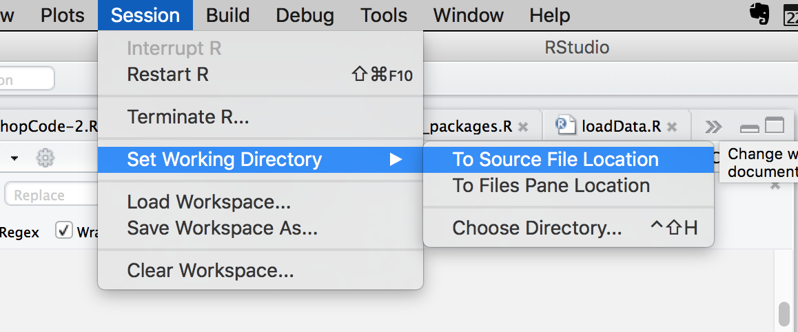

```{r setup, include=FALSE}
knitr::opts_chunk$set(echo = TRUE)
```

## WebMaps in R with Leaflet

Welcome! While we're waiting:

* Please download the workshop files from: [https://github.com/dlab-geo/r-leaflet-workshop](https://github.com/dlab-geo/r-leaflet-workshop)
   
* Unzip the Zipfile: [https://github.com/dlab-geo/r-leaflet-workshop/archive/master.zip](https://github.com/dlab-geo/r-leaflet-workshop/archive/master.zip)

* Open RStudio

* Open a new R script file


#Introduction

##Outline

Basic Maps

* Marker Maps
* Adding Popups

Data Maps

* Symbology for mapping point data
* Choropleth maps
* Adding Legends

Doing More

* Customizing the UI
* Sharing your maps

##Setup
This workshop/tutorial will walk you through the basics of using the Leaflet mapping package in R. You can follow along in any of the three formats:

* *Tutorial Page* (leaflet-webmaps-in-R.html)
* *Raw code* (leaflet-webmaps-in-R.R)
* *Slides* (leaflet-webmaps-in-R-slides.html)

Make sure you can copy and paste from one of the above into the script.

To begin, lets set up our packages and environment.

```{r global_options, include=FALSE}
knitr::opts_chunk$set(fig.width=8, echo=TRUE, warning=FALSE, message=FALSE)
```

##Loading packages

Load the packages we will use today

```{r, message=FALSE, warning=FALSE}
library(leaflet)
library(RColorBrewer)
library(sp)
library(rgdal)
library(htmlwidgets)
library(magrittr) # or dplyr
```

Install any packages that you do not have on your computer

```{r, eval=FALSE}
# install.packages("leaflet")
# install.packages("RColorBrewer")
# install.packages("sp")
# install.packages("rgdal")
# install.packages("htmlwidgets")
# install.packages("magrittr") # or dplyr
```

## Set working directory

to the folder in which you unzipped the workshop files

</img>


# Leaflet

## Leaflet

[Leaflet](http://leafletjs.com/) is a lightweight, yet powerful javascript library for creating interactive web maps.

</img>

Leaflet maps are a combination of HTML and Javascript code that is meant to be rendered in a web browser.

We can use the R `leaflet` package to create Leaflet maps in R

## Why the package `leaflet`?

There are a number of R packages for making Leaflet maps.

- `leaflet` is actively maintained, highly customizable, and integrates well with other R libraries.

- `tmap` is easier for getting started but less customizeable
    - also great for interactive data analysis


# Our First Leaflet Map

## Our first Leaflet map
```{r,eval=F}
map1 <- leaflet()       # Initialize the map object
map1 <- addTiles(map1)  # Add basemap tiles
map1                    # Display the map
```

**WARNING** don't call your map object `map`

## Our first Leaflet map

```{r}
map1 <- leaflet()       # Initialize the map object
map1 <- addTiles(map1)  # Add basemap tiles - default is OpenStreetMap
map1                    # Display the map

```                  


## Setting the view

Specify the `center` and `zoom` level for the map

```{r, message=FALSE, results="hide"}
map1 <- leaflet() %>%
        addTiles() %>%  
        setView(lat=37.870044, lng=-122.258169, zoom = 15)
map1  
```

## Setting the view
```{r}
map1  # setView(lat=37.870044, lng=-122.258169, zoom = 15)
```


## Piping Syntax

Chains commands so that the output of one command becomes the input of the next command.

```{r, results="hide"}
map2 <- leaflet() %>%
        addTiles() %>%  
        setView(lat=37.870044, lng=-122.258169, zoom = 15)
map2   
```

**Requires `dplyr` or `magrittr` package to be loaded**

## Piping gives us the same map

```{r}
map2
```

## Syntax Comparison

**Regular**
```
map1 <- leaflet()        
map1 <- addTiles(map1)   
map1 <- setView(map1, lat=37.870044, lng=-122.258169, zoom = 15)
map1                  

```
<hr>
**Piping**
```
map2 <- leaflet() %>%
        addTiles() %>%  
        setView(lat=37.870044, lng=-122.258169, zoom = 15)
map2   
```

## Challenge

Create a leaflet map centered on the Doe Library

- You can get the coordinates by right clicking in Google Maps and selecting `what's here`


`Questions`

- What zoom level displays the names of campus buildings?
- What zoom level shows all of Berkeley?
- What is the max/min zoom level that returns a basemap?

## The basemap

By Default, Leaflet uses the [OpenStreetMap](https://www.openstreetmap.org/#map=5/38.007/-95.844) basemap, which is added with the `addTiles()` function
```{r, message=F}
leaflet() %>% addTiles() %>% 
           setView(lat=37.870, lng=-122.258, zoom = 15)
```


## addProviderTiles

Use `addProviderTiles` with the name of the `basemap` to add a different basemap.

Create a leaflet map with the `ESRI World Street Map` basemap.

```{r}
map2 <- leaflet() %>%
        addProviderTiles("Esri.WorldStreetMap") %>% 
        setView(lat=37.870044, lng=-122.258169, zoom = 12)
 
```


## View it

```{r}
map2   #Using ESRI WorldStreetMap basemap
```

## Specify a Basemap

Add a different basemap by taking a look at this web page of available basemaps

[http://leaflet-extras.github.io/leaflet-providers/preview/](http://leaflet-extras.github.io/leaflet-providers/preview/)

Use the `provider name` in quotes to access the basemap.

## CartoDB Positron Basemap

```{r}
leaflet() %>% addProviderTiles("CartoDB.Positron") %>% 
    setView(lat=37.870044, lng=-122.258169, zoom = 12)
```

## Getting Help

For more info, read the documentation  

```{r, eval=F}
?addProviderTiles
```


# Mapping Data

## Let's Add Point Data as a Marker


```{r, echo=F}
map3 <- leaflet() %>%
  addTiles() %>%  # Add default OpenStreetMap map tiles
  #setView(lat=37.870044, lng=-122.258169, zoom = 17) %>%
  addMarkers(lat=37.870044, lng=-122.258169, popup="Go Bears!")
map3

```

## addMarkers

Use `addMarkers` to add one or more data points to the map.

```{r, eval=F}
map3 <- leaflet() %>%
  addTiles() %>%
  addMarkers(lat=37.870044, lng=-122.258169, popup="Go Bears!")
map3
```

## addMarkers

```{r, echo=F}
map3
```


## addMarkers Code

```{r, eval=F}
map3 <- leaflet() %>%
  addTiles() %>%
  #setView(lat=37.870044, lng=-122.258169, zoom = 17) %>%
  addMarkers(lat=37.870044, lng=-122.258169, popup="Go Bears!")
map3
```

- The map will automatically center on the marker data and determine the zoom level.

- You don't need to use `setView` (commented out).

- But, you can override the default center & zoom by using `setView`.

*What does `popup=` do?*


## addMarkers Documentation

?addMarkers

```{r, eval=F}
addMarkers(map, lng = NULL, lat = NULL, layerId = NULL, group = NULL,
  icon = NULL, popup = NULL, popupOptions = NULL, label = NULL,
  labelOptions = NULL, options = markerOptions(), clusterOptions = NULL,
  clusterId = NULL, data = getMapData(map))
```

## Challenge

How would you add a second marker for Cafe Milano?

- 37.868641, -122.258537

- Try it?

## Two Markers

```{r}
map3 <- leaflet() %>%
  addTiles() %>%
  addMarkers(lat=37.870044, lng=-122.258169, popup="Go Bears!") %>%
  addMarkers(lat=37.868641, lng=-122.258537, popup="Cafe Milano")
map3
```

## Two Markers again

```{r}
map3 <- leaflet() %>%
  addTiles() %>%
  addMarkers(lat = c(37.870044,37.868641), 
             lng = c(-122.258169,-122.258537),
             popup = c("Go Bears", "Cafe Milano"))

map3
```


# Questions?
 

# Mapping Data Frames

## Bart Stations

Source: [Caltrans GIS Data](http://www.dot.ca.gov/hq/tsip/gis/datalibrary/Metadata/BART_13.html)

```{r}
bart <- read.csv('data/bart.csv', stringsAsFactors = FALSE)  
str(bart)
```

*What column(s) contain the geographic data?*

## Mapping Bart Stations as Markers

```{r, results="hide"}
map4 <- leaflet() %>%
         addTiles() %>%   
         addMarkers(lat=bart$Y, lng=bart$X, 
         popup= paste("Station:", bart$STATION))
map4
```

## Mapping Bart Stations as Markers
```{r}
map4
```

## Geographic Data Files

Point data are often stored in `CSV` files and loaded into R data frames.

These point data are manipulated like other R data frames.

Leaflet can map these data if the points use geographic coordinates (longitude & latitude).

More complex geographic data are commonly stored in `ESRI Shapefiles`.

To get the most out of spatial data in R you should use packages specifically for working with spatial data.


# Spatial Data in R

## Spatial Data in R

We can use the `sp` and `rgdal` packages to import, manipulate and map more complex spatial objects.

`sp` - **R classes and methods for spatial data**

`rgdal` - **Functions for importing and transforming spatial data**

Let's use these to import data in ESRI Shapefiles


## Read in an ESRI Shapefile

`BART Lines`

Source: [Caltrans GIS Data](http://www.dot.ca.gov/hq/tsip/gis/datalibrary/Metadata/BART_13.html)
```{r}
dir("data/BART_13/")
```

## BART Lines

Use `rgdal` to read in the data from a Shapefile

```{r}
library(rgdal)
bart_lines <- readOGR(dsn="data/BART_13",layer="BART_13")
```

## BART Lines

Take a look at the data

```{r}
summary(bart_lines)
```


## BART Lines

Use `addPolyLines` to add linear features

```{r, results="hide"}
map4 <- leaflet() %>%
         addTiles() %>%   
         addMarkers(lat=bart$Y, lng=bart$X, 
         popup= paste("Station:", bart$STATION)) %>%   
         addPolylines(data=bart_lines, color="red", weight=3)
map4
```

*Leaflet can map both data frames & spatial objects!*

## BART Stations & Lines
```{r}
map4

```


## BART Service Areas

Let's add BART Service Area data from the  [Metropolitan Transportation Commission (MTC)](http://opendata.mtc.ca.gov)

```{r}
dir("data/Transit_Service_Areas_2016")
```

## BART Service Areas

Let's add BART Service Area data from the  [Metropolitan Transportation Commission (MTC)](http://opendata.mtc.ca.gov)

```{r}
bart_service <- readOGR(dsn="data/Transit_Service_Areas_2016",layer="bart_service_area")
```

## BART Service Areas

Take a look at the data

```{r}
summary(bart_service)
```


## BART Service Areas

Use `addPolygons` to add area features

```{r, results="hide"}
map4 <- leaflet() %>%
         addTiles() %>%   
         addMarkers(lat=bart$Y, lng=bart$X, 
         popup= paste("Station:", bart$STATION)) %>%   
         addPolylines(data=bart_lines, color="red", weight=3) %>%
         addPolygons(data=bart_service, color="blue", opacity = 0.6)
map4
```


## BART Stations, Lines & Service Areas
```{r}
map4

```

## CHALLENGE

Redo the previous map and:

- change the basemap to "CartoDB.Positron"

- set the default view to center on San Francisco


## Save the Map

Save the map as an HTML file that you can then open in a browser, share with friends, put online.

```{r}
#library(htmlwidgets)
saveWidget(map4, file="bartmap.html")
```

# Questions?


# Part II: Mapping larger datasets


## Mapping SF Property Data

[San Francisco Open Data Portal](https://data.sfgov.org)

[SF Property Tax Rolls](https://data.sfgov.org/Housing-and-Buildings/Assessor-Historical-Secured-Property-Tax-Rolls/wv5m-vpq2)

This data set includes the Office of the Assessor-Recorder’s secured property tax roll spanning from 2015.

We are using this as a proxy for home values.

We are working with a simplified version of the full data set.

## Load the CSV file into a data frame

*Set your working directory first to the folder where you downloaded the workshop files!*
```{r }
sfhomes <- read.csv('data/sfhomes15.csv', stringsAsFactors = FALSE)  
str(sfhomes)
```

## Explore the data

 
```{r }
head(sfhomes)
```

## Map the data

```{r}
map4 <- leaflet() %>%
  addTiles() %>%   
  addMarkers(lat=sfhomes$lat, lng=sfhomes$lon, 
            popup= paste("Address:", sfhomes$Address,
                         "<br>", # add line break
                         "Property Value: ", sfhomes$Value))

```

## Display the Map

```{r}
map4    
```

## Popups Made Easier

We can add to and save the popup code and re-use it instead of typing it over and over again.

```{r}
popup_content <- paste("<b>Address:</b>", sfhomes$Address,"<br>", 
                       "<b>Property Value</b>: ", sfhomes$Value, "<br>",
                       "<b>Neighborhood:</b> ", sfhomes$Neighborhood, "<br>",
                       "<b>Num Bedrooms: </b>", sfhomes$NumBeds, "<br>",
                       "<b>Num Bathrooms:</b>", sfhomes$NumBaths
                       )
```

```{r}

map4 <- leaflet() %>%
          addTiles() %>%   
          addMarkers(lat=sfhomes$lat, lng=sfhomes$lon, 
                     popup= popup_content)
```

## Customizing the Popup
```{r}
map4
```


## Shorter syntax

Instead of this:
```{r, eval=F}
leaflet() %>%  
  addTiles() %>%   
  addMarkers(lat=sfhomes$lat, lng=sfhomes$lon, popup= popup_content)
```


We can use this syntax:
```{r, eval=F}
leaflet(sfhomes) %>%
  addTiles() %>%   
  addMarkers(~lon, ~lat, popup = popup_content)
```

When the addMarkers function arguments `lng=` and `lat=` are not named they must be in the expected order (longitude, latitude)!


## Too Many Markers!

Read the `addMarker` documentation for options to address this.

```{r, eval=FALSE}

addMarkers(map, lng = NULL, lat = NULL, layerId = NULL, 
           group = NULL, icon = NULL, popup = NULL, 
           options = markerOptions(), 
           clusterOptions = NULL, clusterId = NULL, 
           data = getMapData(map))
```

## Cluster Option

```{r}
map4 <- leaflet(sfhomes) %>%
  addTiles() %>%   
  addMarkers(~lon, ~lat, popup= popup_content,
            ###<b>
            clusterOptions = 1)
            ###</b>
 
```

## Cluster Option

```{r}
map4  # Explore the Map - hover over a cluster marker, zoom in.
```


## Mapping Points as Circles

`addCircleMarker`

```{r}
map4 <- leaflet(sfhomes) %>%
  addTiles() %>%   
  addCircleMarkers(~lon, ~lat, popup = popup_content)
 
```

## Mapping Points as Circles

`addCircleMarker`

```{r}

map4 
```

## addCircleMarkers

```{r, eval=F}
addCircleMarkers(map, lng = NULL, lat = NULL, radius = 10, 
    layerId = NULL, group = NULL, stroke = TRUE, color = "#03F", 
    weight = 5, opacity = 0.5, 
    fill = TRUE, fillColor = color, ....)
```

## Customize the circleMarkers

Change color, radius and stroke weight of circle markers

```{r}
map4 <- leaflet(sfhomes) %>%
  addTiles() %>%   
  addCircleMarkers(~lon, ~lat, popup = popup_content,
             color="white", radius=6, weight=2,   # stroke
             fillColor="red",fillOpacity = 0.75   # fill
             )
```
- Use `colors()` to see a list of all R named colors.
- You can expand on these with [hexidecimal color values](http://www.color-hex.com).


## Customize the circleMarkers

```{r }
map4 
```

## Question

Can you cluster `circleMarkers`?


# Data Driven Symbology

## Data Driven Symbology

Use data values to determine the `color` and `size` of symbols.

## Mapping Points by Size

We can symbolize the size of points by data values by making the `radius` of the circle a function of a data value.

```{r}
map4 <- leaflet(sfhomes) %>%
  addProviderTiles("CartoDB.Positron") %>%
  addCircleMarkers(~lon, ~lat, popup=popup_content,
             fillColor= NA, color="Red", weight=1, fillOpacity = 0,
             ###<b>
             radius= ~NumBeds+2
             ###</b>
             )
```

## Mapping Points by Size

```{r}
map4  # Size is a function of what variable?
```

## addCircles vs addCircleMarkers

`Circles` and `CircleMarkers` look quite similar.

`Circle` radii are specified in meters while `CircleMarkers` are specified in pixels.


```{r}
map4b <- leaflet(sfhomes) %>%
  addProviderTiles("CartoDB.Positron") %>%
  addCircles(~lon, ~lat, popup=popup_content,
             fillColor= NA, color="Red", 
             weight=1, fillOpacity = 0,
             ###<b>
             radius= ~NumBeds*10
             ###</b>
             )
```

## addCircles

Circle radii are specified in meters not pixels - Zoom in to see how it works.
```{r}
map4b  # Compare map4 and map4b at different zoom levels
```

# Mapping Data by Color

## Color


## Color


## Color

<iframe src="https://giphy.com/embed/l1J9NQ6mXwcKmP4Zy" width="480" height="270" frameBorder="0" class="giphy-embed" allowFullScreen></iframe>

## RColorBrewer

The `RColorBrewer` package is widely used to create color palettes for maps.

- A color palette is a set of colors

There are 3 types of  color palettes

1. `Qualitative` Color Palettes
2. `Sequential` Color Palettes
3. `Diverging` Color Palettes

## Qualitative Palettes

Contrasting colors for categorical data
```{r}
 
display.brewer.all(type="qual") 
display.brewer.pal(7, "Set3" )  # Try a different number of colors
```

## Sequential Palettes

For highlighting trends in numerical data
```{r}
display.brewer.all(type="seq")

```

## Diverging Palettes

For highlighting the outliers
```{r}
display.brewer.all(type="div")
```

# Color Mapping in Leaflet

## Map Homes by Neighborhood 

Let's map `sfhomes` by the values in the `Neighborhood` column.

First, check out the RColorBrewer qualitative color palettes
```{r}
display.brewer.all(type="qual")
```

## Associate Colors with Data

`colorfactor` takes as input a color palette and a *domain* that contains the full range of possible values to be mapped.

`colorfactor` returns a **function** specific to that domain that can be used to output a set of color values.

```{r, message=T, warning=T}
# Create a qualitative color palette
myColor_function <- colorFactor("Paired", sfhomes$Neighborhood) 
```


## Using colorFactor Function


```{r}
map4 <- leaflet(sfhomes) %>%
  addProviderTiles("CartoDB.Positron") %>%
  addCircleMarkers(~lon, ~lat,  
             popup= popup_content,
             ###<b>
             fillColor= ~myColor_function(Neighborhood),
             ###</b>
             radius=6, color=NA, weight=2, fillOpacity = 1
             )
```

## Homes by Neighborhood
```{r}
map4  # what neighborhood had the most 2015 transactions?
```

# Add a Legend

## Add a Legend

```{r}
map4 <- leaflet(sfhomes) %>%
  addProviderTiles("CartoDB.Positron") %>%
  addCircleMarkers(~lon, ~lat, popup=popup_content,
             fillColor= ~myColor_function(Neighborhood),
             radius=6, color=NA, weight=2,fillOpacity = 1
             ) %>%
      ### <b>
      addLegend(title = "Neighborhood", pal =  myColor_function,
                values = ~Neighborhood, opacity = 1, 
                position="bottomleft")
      ### </b>
```

## Add a legend
```{r}
map4 
```

## colorFactor

For mapping colors to qualitative data

`?colorfactor`

```{r, eval =F}
colorFactor(palette, domain, levels = NULL, ordered = FALSE,
  na.color = "#808080", alpha = FALSE, reverse = FALSE)
```

## Mapping Colors to Numeric Values

Let's map the homes by value.

First, check out the sequential color palettes
```{r}
display.brewer.all(type="seq")
```

## leaflet::colorNumeric

For simple linear scaling of colors to values use `colorNumeric`.

First, create the color mapping function
```{r}
numColor_function <- colorNumeric("Reds", sfhomes$Value)
```


## Proportional Color Map

Use the `numColor_function` to create a `proportional color map`

```{r}
map4 <- leaflet(sfhomes) %>%
  addProviderTiles("CartoDB.Positron") %>%
  addCircleMarkers(~lon, ~lat, popup=popup_content,
            ### <b>
             fillColor= ~numColor_function(Value),
            ### </b>
             radius=6, color="grey", weight=1, fillOpacity = 1
             ) %>%
      addLegend(title = "Property Values", pal =  numColor_function,
                values = ~Value, opacity = 1, 
                position="bottomleft")
      
```

##
```{r}
map4  # proportional color map
```

## colorNumeric

For simple linear scaling of colors to values use `colorNumeric`.

?colorNumeric

```{r, eval=F}
colorNumeric(palette, domain, na.color = "#808080", alpha = FALSE,
  reverse = FALSE)
```


## Quantile Colors

Use `colorQuantile` to create a color palette based on quantile binning of the data. 

First, create the color mapping function
```{r}
quantColor_function <- colorQuantile("Reds", sfhomes$Value, n=5)
```

## Graduated Color Map

Use the color function to map colors to house values
```{r}
map4b <- leaflet(sfhomes) %>%
  addProviderTiles("CartoDB.Positron") %>%
  addCircleMarkers(~lon, ~lat, popup=popup_content,
            ### <b>
             fillColor= ~quantColor_function(Value),
            ### </b>
             radius=6, color="grey", weight=1,fillOpacity = 1
             ) 


```

## 
```{r}
map4b  # Graduated color map
```

## colorQuantile

For mapping colors to data binned by quantiles

?colorQuantile

```{r, eval=F}
colorQuantile(palette, domain, n = 4,
  probs = seq(0, 1, length.out = n + 1),
  na.color = "#808080", alpha = FALSE, reverse = FALSE)
```

## colorBin

For more control over customizing colors see the `colorBin` function which can be used to create color palettes based on different classification methods for binning the data, eg equal interval, natural breaks etc.

`?colorBin`


## Add A Legend
```{r}
map4b %>%  addLegend(title = "Value", pal =  quantColor_function,
                values = ~Value, opacity = 1, 
                position="bottomleft")
```


## Customize the Legend
```{r}

map5 <-map4b %>%   addLegend(pal = quantColor_function, values = ~Value,
                     title = "Property Value, 2015",
                     position="bottomleft",
                     opacity=1,
                     labFormat = function(type, cuts, p) {
                      n = length(cuts)
                      cuts = paste0("$", format(cuts[-n], big.mark=","), 
                              " - ", "$",format(cuts[-1], big.mark=","))
                      }
                   )
```

##
```{r}
map5  # Graduated Color Map
```


# Questions

# Recap

## Recap

Basic Maps

* `addMarkers` - Simple Marker Maps
* `addCircleMarkers` - Circle Marker Maps

Data Maps

* `addCircles` Proportional symbol maps
* `colorFactor` - Category Maps
* `colorNumeric` - Proportional color maps
* `colorQuantile` - Graduated color maps


# Choropleth Maps

## Choropleth Maps

Color areas based on data values.

The data values are classified into bins.

Quantile classification is the default.

Each bin gets a unique color from a color palette.
 

## Read in SF Income Data

```{r}
sf_md_hhi <- readOGR(dsn="data",layer="sf_medhhincome_acs5y_16")

```

## Explore the data
```{r}
summary(sf_md_hhi)
```

## Map a SpatialPolygonsDataFrame

Map `sf_md_hhi` with `addPolygons`
```{r}
map6 <- leaflet() %>%
  addTiles() %>%
  addPolygons(data=sf_md_hhi)

```

## Map a SpatialPolygonsDataFrame
```{r}
map6 # using addPolygons to map sf_md_hhi
```


## Customizing the symbology

?addPolygons

```{r, eval=F}
addPolygons(map, lng = NULL, lat = NULL, layerId = NULL, group = NULL,
            stroke = TRUE, color = "#03F", weight = 5, opacity = 0.5,
            fill = TRUE, fillColor = color, fillOpacity = 0.2, 
            dashArray = NULL, smoothFactor = 1, noClip = FALSE, 
            popup = NULL, popupOptions = NULL, label = NULL, 
            labelOptions = NULL, options = pathOptions(),
            highlightOptions = NULL, data = getMapData(map))
```

## Customizing the symbology

```{r}
map6 <- leaflet() %>%
  setView(lng=-122.448889, lat=37.764645, zoom=12) %>%
  addProviderTiles("CartoDB.Positron") %>%
  
  # Customize the symbology of the polygons
  addPolygons(data=sf_md_hhi, color="grey", weight=1,
              fillColor="Orange", fillOpacity = 0.25)

```

## SF Census Tracts
```{r}
map6  # color="grey", weight=1, fillColor="Orange", fillOpacity = 0.25
```


## Create a choropleth map

Median Household Income is in the `estimate` column

Recipe:

1. Create a color function based on the values of `estimate`
2. Map the polygons setting the color to values produced by the color function

## Create the Color Palette Function

* First, select the name of the color palette
```{r}
#display.brewer.all(type="seq") 
```

Then create the color mapping function
```{r}
##
quantColor_function <- colorQuantile("YlOrRd", sf_md_hhi$estimate, n=5)
```

## Create the Choropleth map

*A choropleth map is a graduated color map of polygon data.*

```{r}
map6 <- leaflet() %>%
  setView(lng=-122.448889, lat=37.764645, zoom=12) %>%
  addProviderTiles("CartoDB.Positron") %>%
  # 
  ### <b>
  addPolygons(data=sf_md_hhi, 
              color="white", 
              weight=1, 
              opacity=0.5,
              fillColor=~quantColor_function(estimate), 
              fillOpacity = 0.65,
              popup = paste0("$",sf_md_hhi$estimate))
   ### </b>
```

## Census Tracts by Med HH Income
```{r}
map6  # choropleth map of median household income by census tract
```

## Add a legend

```{r}
map6 <- map6 %>% addLegend(pal = quantColor_function, 
                   values = sf_md_hhi$estimate,
                   title = "Median HH Income",
                   position="bottomleft",
                   opacity=1,
                   labFormat = function(type, cuts, p) {
                     n = length(cuts)
                     cuts = paste0("$", format(cuts[-n], big.mark=","), 
                             " - ", "$",format(cuts[-1], big.mark=","))
                   }
)
```

## Med HH Income Legend
```{r}
map6
```

## Map Overlays

You can add multiple data layers to a leaflet map.

Let's add the `sfhomes` to the map

```{r}
cheap <- sfhomes[sfhomes$Value < 1000000,]

map7 <- leaflet() %>%
  setView(lng=-122.448889, lat=37.764645, zoom=12) %>%
  addProviderTiles("CartoDB.Positron") %>%
  
  # Median household income polygons
  addPolygons(data=sf_md_hhi, color="white", weight=1, opacity=0.5,
              fillColor=~quantColor_function(estimate), fillOpacity = 0.65,
              popup = paste0("$",sf_md_hhi$estimate)) %>%
  
  # sfhomes points
  addCircleMarkers(data=cheap, popup=paste0("$",cheap$Value),
              color="black",weight=1, radius=6, 
              fillColor="white", fillOpacity = 0.75)

```

## Map Overlays
```{r}
map7  # sfhomes and median household income

```

## Getting Control

We can add a layer switcher control with `addLayersControl()`.

This allows us to toggle on/off the display of a map layer.

First, we need to assign a `group` to each map layer

```{r, eval=F}
?addLayersControl
```

## Assign Group & Add Layers Control
```{r}
map8 <- leaflet() %>%
          setView(lng=-122.448889, lat=37.764645, zoom=12) %>%
          addProviderTiles("CartoDB.Positron") %>%
          addPolygons(data=sf_md_hhi, color="white", weight=1, opacity=0.5,
              fillColor=~quantColor_function(estimate), fillOpacity = 0.65,
              popup = paste0("$",sf_md_hhi$estimate),
              ### <b>
              group="Median HH Income"
              ### </b>
          ) %>%
          addCircleMarkers(data=cheap, popup=paste0("$",cheap$Value),
              color="black",weight=1, radius=6, 
              fillColor="white", fillOpacity = 0.75,
              ### <b>
              group="Property Values"
              ### </b>
          ) %>%
          ### <b>
          addLayersControl(
            overlayGroups = c("Property Values","Median HH Income"),
            options = layersControlOptions(collapsed = FALSE)
          ### </b>
        )

```

## Map with Layer Controls
```{r}
map8
```

## Add Basemap(s) to Layer Control

```{r}
map8 <- leaflet() %>%
          setView(lng=-122.448889, lat=37.764645, zoom=12) %>%
          addProviderTiles("CartoDB.Positron", group="Simple Basemap") %>%
          addProviderTiles("Esri.WorldStreetMap", group="Streets Basemap")  %>%
          addTiles("", group="No Basemap") %>%  
          #
          addPolygons(data=sf_md_hhi, color="white", weight=1, opacity=0.5,
              fillColor=~quantColor_function(estimate), fillOpacity = 0.65,
              popup = paste0("$",sf_md_hhi$estimate),
              group="Median HH Income"
          ) %>%
          addCircleMarkers(data=cheap, popup=paste0("$",cheap$Value),
              color="black",weight=1, radius=6, 
              fillColor="white", fillOpacity = 0.75,
              group="Property Values"
          ) %>%
          addLayersControl(
            baseGroups = c("Simple Basemap", "Streets Basemap", "No Basemap"),
            overlayGroups = c("Property Values","Median HH Income"),
            options = layersControlOptions(collapsed = FALSE)
        )

```

## Layer Controls
```{r}
map8
```

# Questions?

# Sharing

## Sharing your web map

Interactive Maps in R - check

Web Maps can be shared if online.

Easy way to go is `RPubs`

## RPubs

You can share you map online by publishing it to [RPubs](https://rpubs.com).

- You need to have an `RPubs` account to make that work.

1. Enter the code for your map in the console

2. In the `Viewer` window, click on the **Publish** icon.

## RPubs

DEMO...
[http://rpubs.com/pfrontiera/368070](http://rpubs.com/pfrontiera/368070)

## Saving your map

Another way to share your map is to save it to a file.
You can then email it, host it on your own web server or host it on github, etc.

```{r}
#library(htmlwidgets)
saveWidget(map7, file="testmap.html")
```

Open your file to by double-clicking on it in the Mac Finder or Windows Explorer.

## Doing more with your `leaflet` maps

`Flexdashboard` 

`Shiny`

`Crosstalk`

## Flexdashboard

[Flexdashboard](https://rmarkdown.rstudio.com/flexdashboard/) is a tool for creating interactive dashboards with R Markdown. 

[Flexdashboard Demo](https://beta.rstudioconnect.com/jjallaire/htmlwidgets-waste-sites/htmlwidgets-waste-sites.html)


## Shiny

A framework for creating interactive web apps based on R code.

[Shiny Demo](https://walkerke.shinyapps.io/neighborhood_diversity/)

[Shiny User Gallery](https://www.rstudio.com/products/shiny/shiny-user-showcase/)
    
[Shiny online tutorial](https://shiny.rstudio.com/tutorial/)

<http://www.shinyapps.io>  -  A **freemium** web platform for hosting your shiny apps.


## Crosstalk

An R package for creating interactive web documents without needing a server.

<https://rstudio.github.io/crosstalk>

*More functionality than Flexdashboard, less than Shiny*


# Questions?

## Next Steps

Getting more Practice

[Leaflet for R Tutorial](https://rstudio.github.io/leaflet/)


## Thanks

To you!

and to Josh Pepper who did an earlier workshop on which these materials are loosely based.

# Extras

## Add A Custom Map Image

You can add an online, *georectified* scanned map to leaflet.

There are many of these online at the [New York Public Library](http://maps.nypl.org/warper/) or [MapWarper](mapwarper.net), and other websites.

Let's add this map of [Berkeley in 1880](https://mapwarper.net/maps/25477#Preview_tab)

</img>


## Berkeley, 1880

*Here we are combining `addTiles` and `addProviderTiles`*

```{r, eval=T, results='hide'}
mapurl <- "https://mapwarper.net/maps/tile/25477/{z}/{x}/{y}.png"

map2 <- leaflet() %>%
  addProviderTiles("CartoDB.Positron") %>%
  addTiles(mapurl) %>%  # custom map image
  setView(lat=37.870044, lng=-122.258169, zoom = 13)
   
```


## Berkeley, 1880

```{r }
map2  # Map of Berkeley, 1880 overlaid on the CartoDB basemap
```

# Questions?
