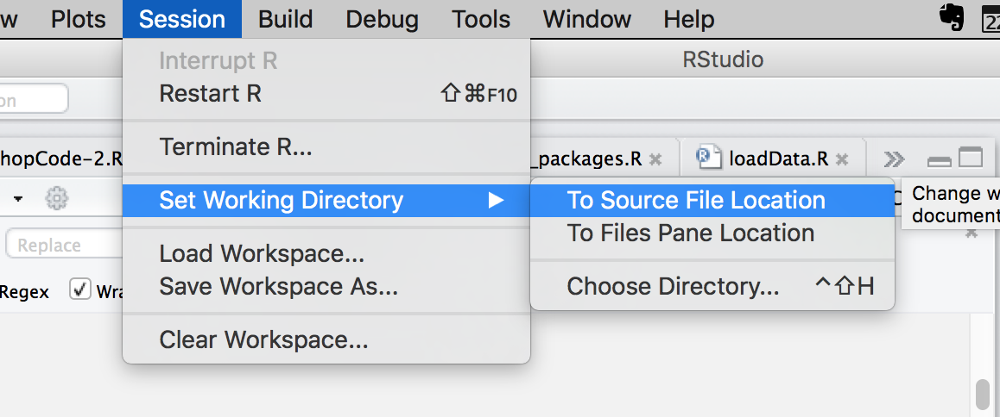

```{r setup, include=FALSE}
knitr::opts_chunk$set(echo = TRUE)
```

## R WebMaps with Leaflet

Welcome! While we're waiting:

* Please download the workshop files from: http://bit.ly/leaflet-workshop-sp2018
* Download zip folder, unzip, and open the file titled: *leaflet-webmaps-in-R-sp2018.html*

```{r, echo=FALSE, fig.height=3, fig.width=10.25, message=FALSE, warning=FALSE}
library(leaflet)
library(RColorBrewer)
library(rgdal)
library(htmlwidgets)
library(magrittr)

leaflet() %>% addTiles()
```

#Introduction

##Outline

Basic Maps

* Marker Maps
* Adding Popups

Data Maps

* Symbology for mapping point data
* Choropleth maps
* Adding Legends

Doing More

* Customizing the UI
* Sharing your maps

##Setup
This workshop/tutorial will walk you through the basics of using the Leaflet mapping package in R. You can follow along in any of the three formats:

* *Tutorial Page* (leaflet-webmaps-in-R-sp2018.html)
* *Raw code* (leaflet-webmaps-in-R-sp2018.R)
* *Slides* (leaflet-webmaps-in-R-sp2018-slides.html)


To begin, lets set up our packages and environment.

```{r global_options, include=FALSE}
knitr::opts_chunk$set(fig.width=8, echo=TRUE, warning=FALSE, message=FALSE)
```

##Loading packages

Load the packages we will use today

```{r, message=FALSE, warning=FALSE}
library(leaflet)
library(RColorBrewer)
library(sp)
library(rgdal)
library(htmlwidgets)
library(magrittr) # or dplyr
```

Install any packages that you do not have on your computer

```{r, eval=FALSE}
# install.packages("leaflet")
# install.packages("RColorBrewer")
# install.packages("sp")
# install.packages("rgdal")
# install.packages("htmlwidgets")
# install.packages("magrittr") # or dplyr
```

##Set working directory


# Leaflet

## Leaflet

[Leaflet](http://leafletjs.com/) is a lightweight, yet powerful javascript library for creating interactive web maps.

</img>

Leaflet maps are a combination of HTML and Javascript code that is meant to be rendered in a web browser.

We can use the R `leaflet` package to create Leaflet maps in R

# Our First Leaflet Map

## Our first Leaflet map
```{r, message=FALSE, results="hide"}
map1 <- leaflet()       # Initialize the map object
map1 <- addTiles(map1)  # Add basemap tiles
map1                    # Display the map
```

## Our first Leaflet map

```{r, echo=F}
# map1 <- leaflet()       # Initialize the map object
# map1 <- addTiles(map1)  # Add basemap tiles - default is OpenStreetMap
map1                    # Display the map

```                  

## Setting the view

Note, we are adding to an exisiting `map1`
```{r, message=FALSE, results="hide"}
map1 <- setView(map1, lat=37.870044, lng=-122.258169, zoom = 15)
map1
```

## Setting the view
```{r, echo=F}
map1
```


## Piping Syntax

**Requires `dplyr` or `magrittr` package to be loaded**
```{r, results="hide"}
map2 <- leaflet() %>%
        addTiles() %>%  
        setView(lat=37.870044, lng=-122.258169, zoom = 15)
map2   
```

## Piping gives us the same map

```{r}
map2
```

## Syntax Comparison

**Regular**
```
map1 <- leaflet()        
map1 <- addTiles(map1)   
map1 <- setView(map1, lat=37.870044, lng=-122.258169, zoom = 15)
map1                  

```
<hr>
**Piping**
```
map2 <- leaflet() %>%
        addTiles() %>%  
        setView(lat=37.870044, lng=-122.258169, zoom = 18)
map2   
```

### WARNING: Don't name your map object `map`

## Challenge

Rerun the `piping` code changing the zoom level

- What zoom level reveals the campus building that the map is centered on?
- What zoom level shows all of berkeley?
- What is the max/min zoom level that returns a basemap?

## Changing the basemap

By Default, Leaflet uses the [OpenStreetMap](https://www.openstreetmap.org/#map=5/38.007/-95.844) basemap.

There are a number of other freely availble basemaps that you can also use.

You can customize the basemap with the `addProviderTiles` function

Check out the documentation  
``` 
?addProviderTiles
```

And open the web page of available basemaps

[http://leaflet-extras.github.io/leaflet-providers/preview/](http://leaflet-extras.github.io/leaflet-providers/preview/)

## Now try a few

Here's the syntax - instead of using `addTiles` you use `addProviderTiles`
```{r}
map2 <- leaflet() %>%
        addProviderTiles("Esri.WorldStreetMap") %>% 
        setView(lat=37.870044, lng=-122.258169, zoom = 12)
 
```

## View it

```{r}
map2
```

## Add Your own map

Source: [https://mapwarper.net/maps/25477#Preview_tab](https://mapwarper.net/maps/25477#Preview_tab)

```{r}
mapurl <- "https://mapwarper.net/maps/tile/25477/{z}/{x}/{y}.png"

map2 <- leaflet() %>%
  addProviderTiles("CartoDB.Positron") %>%
  addTiles(mapurl) %>%  # custom
  setView(lat=37.870044, lng=-122.258169, zoom = 13)
   
```

### Here we are combining `addTiles` and `addProviderTiles`  

## Add a non-provider map

```{r }
map2  
```

# Questions?

# Mapping Data

## Add Data with a Marker

Note that the `setView` function is commented out.

- The map will center on the center of the data points and determine an appropriate zoom leve.
- You can override this by using `setView`.
```{r}
map3 <- leaflet() %>%
  addTiles() %>%  # Add default OpenStreetMap map tiles
  #setView(lat=37.870044, lng=-122.258169, zoom = 17) %>%
  addMarkers(lat=37.870044, lng=-122.258169, popup="Go Bears!")

```

## Add Data with a Marker

```{r}
map3  # Display the map  - Click on the marker
```
 

# Mapping Data Sets

## The Sample Data

[San Francisco Open Data Portal](https://data.sfgov.org)

[SF Property Tax Rolls](https://data.sfgov.org/Housing-and-Buildings/Assessor-Historical-Secured-Property-Tax-Rolls/wv5m-vpq2)

This data set includes the Office of the Assessor-Recorder’s secured property tax roll spanning from 2015.

We are using this as a proxy for home values.

We are working with a simplified sample of the full data set.

## Load the CSV file into a data frame

*Set your working directory first to the folder where you downloaded the workshop files!*
```{r }
sfhomes <- read.csv('data/sfhomes15.csv', stringsAsFactors = FALSE)  
str(sfhomes)
```

## Explore the data

 
```{r }
head(sfhomes)
```

## Map the data

```{r}
map4 <- leaflet() %>%
  addTiles() %>%   
  addMarkers(lat=sfhomes$lat, lng=sfhomes$lon, 
            popup= paste("Address:", sfhomes$Address,
                         "<br>", 
                         "Property Value: ", sfhomes$Value))

```

## Map the data

```{r}
map4    # Thoughts?
```

## Popups Made Easier

We can save the popup code as a string and re-use it instead of typing it over and over again.

* Note a little HTML knowledge can go a long way!
```{r}
popup_content <- paste("<b>Address:</b>", sfhomes$Address,"<br>", 
                       "<b>Property Value</b>: ", sfhomes$Value, "<br>",
                       "<b>Neighborhood:</b> ", sfhomes$Neighborhood, "<br>",
                       "<b>Num Bedrooms: </b>", sfhomes$NumBeds, "<br>",
                       "<b>Num Bathrooms:</b>", sfhomes$NumBaths
                       )
```

## Map the data

We can also use shorter syntax


```{r}
 
map4 <- leaflet(sfhomes) %>%
  addTiles() %>%   
  addMarkers(~lon, ~lat, popup = popup_content)
```

- By passing in the name of the data object to `leaflet` we can reference column values directly.
- Note also that we are using the `tilde` operator to map the data to the addMarkers function.
- When `lng` and `lat` are not named (e.g. `lng=lon`) then they must be in the expected order (lng, lat).

## Map the data
```{r }
map4   # - check out the popups now
```

## Dig deeper

The map is too crowded with Markers.

Read the `addMarker` documentation for options to address this.
```{r, eval=FALSE}
addMarkers(map, lng = NULL, lat = NULL, layerId = NULL, 
           group = NULL, icon = NULL, popup = NULL, 
           options = markerOptions(), 
           clusterOptions = NULL, clusterId = NULL, 
           data = getMapData(map))
```

## Cluster Option

```{r}
map4 <- leaflet(sfhomes) %>%
  addTiles() %>%   
  addMarkers(~lon, ~lat, popup= popup_content,
            ###<b>
            clusterOptions = 1)
            ###</b>
 
```

## Cluster Option

```{r}
map4  # Explore the Map - hover over a cluster marker, zoom in.
```


## Mapping Points as Circles

`addCirleMarker`

```{r}
map4 <- leaflet(sfhomes) %>%
  addTiles() %>%   
  addCircleMarkers(~lon, ~lat, popup = popup_content)
 
```

## Mapping Points as Circles

`addCirleMarker`

```{r}

map4 
```

## addCircleMarkers

```{r, eval=F}
addCircleMarkers(map, lng = NULL, lat = NULL, radius = 10, 
    layerId = NULL, group = NULL, stroke = TRUE, color = "#03F", 
    weight = 5, opacity = 0.5, 
    fill = TRUE, fillColor = color, ....)
```

## Customize the circleMarkers

Change color, radius and stroke weight of circle markers

```{r}
map4 <- leaflet(sfhomes) %>%
  addTiles() %>%   
  addCircleMarkers(~lon, ~lat, popup = popup_content,
             color="white", radius=6, weight=2,   # stroke
             fillColor="red",fillOpacity = 0.75   # fill
             )
```
- Use `colors()` to see a list of all R named colors.
- You can expand on these with [hexidecimal color values](http://www.color-hex.com).


## Customize the circleMarkers

```{r }
map4 
```

# Data Driven Symbology

## Cartography

Art + Science

Finding the right symbology - size, color, shape, etc 

and mapping it to your data

Often requires a classification scheme

## Mapping Points by Size

We can symbolize the size of points by data values by making the radius of the circle a function of a data value.

```{r}
map4 <- leaflet(sfhomes) %>%
  addProviderTiles("CartoDB.Positron") %>%
  addCircleMarkers(~lon, ~lat, popup=popup_content,
             fillColor= NA, color="Red", weight=1, fillOpacity = 0,
             ###<b>
             radius= ~NumBeds+2
             ###</b>
             )
```

## Mapping Points by Size

```{r}
map4
```

## addCircles vs addCircleMarkers

Circles and Circle Markers look quite similar.

Circle radii are specified in meters while Circle Markers are specified in pixels.


```{r}
map4 <- leaflet(sfhomes) %>%
  addProviderTiles("CartoDB.Positron") %>%
  addCircles(~lon, ~lat, popup=popup_content,
             fillColor= NA, color="Red", 
             weight=1, fillOpacity = 0,
             ###<b>
             radius= ~NumBeds*10
             ###</b>
             )
```

##
```{r}
map4
```

# Mapping Data by Color

## RColorBrewer

The RColorBrewer package is widely used to create color palettes for maps.

- A color palette is a set of colors

## Qualitative Palettes

Contrasting colors for categorical data
```{r}
 
display.brewer.all(type="qual") 
display.brewer.pal(7, "Set3" )  # Try a different number of colors
```

## Sequential Palettes

For highlighting trends in numerical data
```{r}
display.brewer.all(type="seq")

```

## Diverging Palettes

For highlighting the outliers
```{r}
display.brewer.all(type="div")
```

## Color Mapping in leaflet

`colorFactor` maps categorical data to colors
```{r, eval =F}
colorFactor(palette, domain, levels = NULL, ordered = FALSE,
  na.color = "#808080", alpha = FALSE, reverse = FALSE)
```


`colorNumeric` applies a simple linear mapping of numeric data to color palette
```{r, eval=F}
colorNumeric(palette, domain, na.color = "#808080", alpha = FALSE,
  reverse = FALSE)
```

## Color Mapping in leaflet

`colorQuantile` assigns colors to numeric data binned by `quantile`
```{r, eval=F}
colorQuantile(palette, domain, n = 4,
  probs = seq(0, 1, length.out = n + 1),
  na.color = "#808080", alpha = FALSE, reverse = FALSE)
```


`colorBin` also assigns colors to binned numeric data, but allows for customization
```{r, eval=F}
colorBin(palette, domain, bins = 7, pretty = TRUE, 
         na.color = "#808080", alpha = FALSE, reverse = FALSE)
```

# Mapping Categories

## Map Homes by Neighborhood 

- with the Leaflet `colorFactor` function
- Check out the available RColorBrewer palettes first
```{r}
display.brewer.all(type="qual")
```

## colorFactor

`colorfactor` takes as input a color palette and a data object (domain) that contains the full range of possible values to be mapped.

`colorfactor` returns a function specific to that domain that can be used to output a range of color values.
```{r, message=T, warning=T}
# Create a qualitative color palette
myColors <- colorFactor("Paired", sfhomes$Neighborhood) 
```

## Test it

```{r}
the_color_values <- myColors(sfhomes$Neighborhood)
length(the_color_values)
length(the_color_values) == length(sfhomes$Neighborhood)
unique(the_color_values)

```


## Homes by Neighborhood

Using a color palette

```{r}
map4 <- leaflet(sfhomes) %>%
  addProviderTiles("CartoDB.Positron") %>%
  addCircleMarkers(~lon, ~lat,  
             popup= popup_content,
             ###<b>
             fillColor= ~myColors(Neighborhood),
             ###</b>
             radius=6, color=NA, weight=2, fillOpacity = 1
             )
```

## Homes by Neighborhood
```{r}
map4  # what neighborhood had the most sales?
```

# Add a Legend

## Add a Legend

```{r}
map4 <- leaflet(sfhomes) %>%
  addProviderTiles("CartoDB.Positron") %>%
  addCircleMarkers(~lon, ~lat, popup=popup_content,
             fillColor= ~myColors(Neighborhood),
             radius=6, color=NA, weight=2,fillOpacity = 1
             ) %>%
      ### <b>
      addLegend(title = "Neighborhood", pal =  myColors,
                values = ~Neighborhood, opacity = 1, 
                position="bottomleft")
      ### </b>
```

## Add a legend
```{r}
map4 
```

## Mapping Colors to Numeric Values

For simple linear scaling of colors to values use `colorNumeric`

```{r}
#display.brewer.all(type="seq")
numColors <- colorNumeric("Reds", sfhomes$Value)
```

## Proportional Color Map

```{r}
map4 <- leaflet(sfhomes) %>%
  addProviderTiles("CartoDB.Positron") %>%
  addCircleMarkers(~lon, ~lat, popup=popup_content,
            ### <b>
             fillColor= ~numColors(Value),
            ### </b>
             radius=6, color="grey", weight=1, fillOpacity = 1
             ) %>%
      addLegend(title = "Property Values", pal =  numColors,
                values = ~Value, opacity = 1, 
                position="bottomleft")
      
```

##
```{r}
map4
```

## Quantile Colors

You can use `colorQuantile` to create a color palette based on quantiles

`?colorQuantile`

Default is 4 bins, but you can set n manually (3 to 7)
```{r}
#display.brewer.all(type="div")
quantColors <- colorQuantile("Reds", sfhomes$Value, n=5)

map4 <- leaflet(sfhomes) %>%
  addProviderTiles("CartoDB.Positron") %>%
  addCircleMarkers(~lon, ~lat, popup=popup_content,
            ### <b>
             fillColor= ~quantColors(Value),
            ### </b>
             radius=6, color="grey", weight=1,fillOpacity = 1
             ) 


```

## 
```{r}
map4
```

## Add A Legend
```{r}
map4 %>%  addLegend(title = "Value", pal =  quantColors,
                values = ~Value, opacity = 1, 
                position="bottomleft")
```


## Customize the Legend
```{r}

map5 <-map4 %>%   addLegend(pal = quantColors, values = ~Value,
                     title = "Property Value, 2015",
                     position="bottomleft",
                     opacity=1,
                     labFormat = function(type, cuts, p) {
                      n = length(cuts)
                      cuts = paste0("$", format(cuts[-n], big.mark=","), 
                              " - ", "$",format(cuts[-1], big.mark=","))
                      }
                   )
```

##
```{r}
map5
```

## Data Order

*What's happening here?*  

```{r, }
sfhomes_low2high <- sfhomes[order(sfhomes$Value, decreasing = FALSE),]

map4 <- leaflet(sfhomes_low2high) %>%
  addProviderTiles("CartoDB.Positron") %>%
  addCircleMarkers(~lon, ~lat, popup=popup_content,
            ### <b>
             fillColor= ~quantColors(Value),
            ### </b>
             radius=6, color="grey", weight=1,fillOpacity = 1
             ) 

```

##
Does the output map look different from previous map?
```{r}
map4
```


# Questions

# Recap

## Recap

Basic Maps

* `addMarkers` - Simple Marker Maps
* `addCircleMarkers` - Circle Marker Maps

Data Maps

* `addCircles` Proportional symbol maps
* `colorFactor` - Category Maps
* `colorNumeric` - Proportional color maps
* `colorQuantile` - Graduated color maps

## Geographic data

We have been working with geographic data in `data frames`

The coordinates are `longitude` and `latitude`

Next up, more complex spatial objects

# Spatial Data in R

## Spatial Data in R

We can use the `sp` and `rgdal libaries to import, manipulate and map more complex spatial objects.

`sp` - **R classes and methods for spatial data**

`rgdal` - **Functions for importing and transforming spatial data**

Let's use these to import data in ESRI Shapefiles

## Read in an ESRI Shapefile

Read in the data
```{r}
sf_md_hhi <- readOGR(dsn="data",layer="sf_medhhincome_acs5y_16")

```

Explore the data
```{r}
class(sf_md_hhi)
head(sf_md_hhi)
```

## Map an SpatialPolygonsDataFrame

Leaflet understands `sp` objects!!!
  
```{r}
map6 <- leaflet() %>%
  addTiles() %>%
  addPolygons(data=sf_md_hhi)

```

## Map an SpatialPolygonsDataFrame
```{r}
map6
```


## Adding custom symbology

?addPolygons

```{r, eval=F}
addPolygons(map, lng = NULL, lat = NULL, layerId = NULL, group = NULL,
            stroke = TRUE, color = "#03F", weight = 5, opacity = 0.5,
            fill = TRUE, fillColor = color, fillOpacity = 0.2, 
            dashArray = NULL, smoothFactor = 1, noClip = FALSE, 
            popup = NULL, popupOptions = NULL, label = NULL, 
            labelOptions = NULL, options = pathOptions(),
            highlightOptions = NULL, data = getMapData(map))
```

## Adding custom symbology

```{r}
map6 <- leaflet() %>%
  setView(lng=-122.448889, lat=37.764645, zoom=12) %>%
  addProviderTiles("CartoDB.Positron") %>%
  addPolygons(data=sf_md_hhi, color="grey", weight=1,
              fillColor="Orange", fillOpacity = 0.25)

```

## SF Census Tracts
```{r}
map6
```

# Choropleth Maps

## Choropleth Maps

Color regions based on data values.

The data values are classified into bins.

- Quantile classification is the default.

Each bin gets a unique color from a color palette.


## Create a choropleth map

Median Household Income is in the `estimate` column

Recipe:

1. Create a color function based on the values of `estimate`
2. Map the polygons setting the color to values produced by the color function

## Color palette

```{r}
##display.brewer.all(type="seq")
quantColors <- colorQuantile("YlOrRd", sf_md_hhi$estimate, n=5)
```

## Apply the palette
```{r}
map6 <- leaflet() %>%
  setView(lng=-122.448889, lat=37.764645, zoom=12) %>%
  addProviderTiles("CartoDB.Positron") %>%
  addPolygons(data=sf_md_hhi, color="white", weight=1, opacity=0.5,
              fillColor=~quantColors(estimate), fillOpacity = 0.65,
              popup = paste0("$",sf_md_hhi$estimate))

```

## Census Tracts by Med HH Income
```{r}
map6
```

## Add a legend

```{r}
map6 <- map6 %>% addLegend(pal = quantColors, 
                   values = sf_md_hhi$estimate,
                   title = "Median HH Income",
                   position="bottomleft",
                   opacity=1,
                   labFormat = function(type, cuts, p) {
                     n = length(cuts)
                     cuts = paste0("$", format(cuts[-n], big.mark=","), 
                             " - ", "$",format(cuts[-1], big.mark=","))
                   }
)
```

## Med HH Income Legend
```{r}
map6
```

## Map Overlays

You can add multiple data layers to a leaflet map.

Let's add the assessed housing value points and see if we can find some cheaper houses in High Income census tracts.

```{r}
cheap <- sfhomes[sfhomes$Value < 1000000,]

map7 <- leaflet() %>%
  setView(lng=-122.448889, lat=37.764645, zoom=12) %>%
  addProviderTiles("CartoDB.Positron") %>%
  addPolygons(data=sf_md_hhi, color="white", weight=1, opacity=0.5,
              fillColor=~quantColors(estimate), fillOpacity = 0.65,
              popup = paste0("$",sf_md_hhi$estimate)) %>%
  addCircleMarkers(data=cheap, popup=paste0("$",cheap$Value),
              color="black",weight=1, radius=6, 
              fillColor="white", fillOpacity = 0.75)

```

## Map Overlays
```{r}
map7
```

## Getting Control

To add 'controls' to our map, we use the function `addLayersControl()`.

We assign a `group` to each basemap and layer (polygon, marker, line, etc). 

Then layer switcher allows us to toggle between different basemaps and turn on/off each of the layers.
```{r, eval=F}
?addLayersControl
```

## Assign a group
```{r}
map8 <- leaflet() %>%
          setView(lng=-122.448889, lat=37.764645, zoom=12) %>%
          addProviderTiles("CartoDB.Positron") %>%
          addPolygons(data=sf_md_hhi, color="white", weight=1, opacity=0.5,
              fillColor=~quantColors(estimate), fillOpacity = 0.65,
              popup = paste0("$",sf_md_hhi$estimate),
              ### <b>
              group="Median HH Income"
              ### </b>
          ) %>%
          addCircleMarkers(data=cheap, popup=paste0("$",cheap$Value),
              color="black",weight=1, radius=6, 
              fillColor="white", fillOpacity = 0.75,
              ### <b>
              group="Property Values"
              ### </b>
          ) %>%
          addLayersControl(
            overlayGroups = c("Property Values","Median HH Income"),
            options = layersControlOptions(collapsed = FALSE)
        )

```

## Layer Controls
```{r}
map8
```

## Add Another Baselayers

```{r}
map8 <- leaflet() %>%
          setView(lng=-122.448889, lat=37.764645, zoom=12) %>%
          addProviderTiles("CartoDB.Positron", group="Simple") %>%
          addProviderTiles("Esri.WorldStreetMap", group="Streets")  %>%
          addPolygons(data=sf_md_hhi, color="white", weight=1, opacity=0.5,
              fillColor=~quantColors(estimate), fillOpacity = 0.65,
              popup = paste0("$",sf_md_hhi$estimate),
              ### <b>
              group="Median HH Income"
              ### </b>
          ) %>%
          addCircleMarkers(data=cheap, popup=paste0("$",cheap$Value),
              color="black",weight=1, radius=6, 
              fillColor="white", fillOpacity = 0.75,
              ### <b>
              group="Property Values"
              ### </b>
          ) %>%
          addLayersControl(
            baseGroups = c("Simple", "Streets"),
            overlayGroups = c("Property Values","Median HH Income"),
            options = layersControlOptions(collapsed = FALSE)
        )

```

## Layer Controls
```{r}
map8
```

# Questions?

# Sharing

## Sharing your web map

Interactive Maps in R - check

Web Maps can be shared if online.

Easy way to go is `RPubs`

## RPubs

You can share you map online by publishing it to [RPubs](https://rpubs.com).

- You need to have an `RPubs` account to make that work.

1. Enter the code for your map in the console

2. In the `Viewer` window, click on the **Publish** icon.

## RPubs

DEMO...
[http://rpubs.com/pfrontiera/368070](http://rpubs.com/pfrontiera/368070)

## Saving your map

Another way to share your map is to save it to a file.
You can then email it, host it on your own web server or host it on github, etc.

```{r}
#library(htmlwidgets)
saveWidget(map7, file="testmap.html")
```

Open your file to by double-clicking on it in the Mac Finder or Windows Explorer.

# Questions?

## Next Steps

Getting more Practice

[Leaflet for R Tutorial](https://rstudio.github.io/leaflet/)

## Many R packages for Leaflet maps

`tmap` 

- great for exploratory data analysis of `sp` objects within R
- much easier than `leaflet` for creating Leaflet maps as well as publication ready static map images.

`mapview`

- This is a new package similar to `tmap`. I haven't checked it out but I keep seeing it so I think it is emerging.

## Why `leaflet`

**Powerful** You can customize it to create great interactive maps

Integrates with `Shiny`, an R web Framework

[Shiny User Gallery](https://www.rstudio.com/products/shiny/shiny-user-showcase/)
    

Demo w/Tutorial at 
    
[https://cengel.shinyapps.io/RioSlaveMarket/](https://cengel.shinyapps.io/RioSlaveMarket/)

## Upcoming Workshops

- Mapbox today at the [GIF](http://gif.berkeley.edu/support/workshops.html)

- [Georectifiying Historical Maps](http://dlab.berkeley.edu/training/georectifying-historical-maps) at DLAB, March 14

## Thanks

To you!

and to Josh Pepper who did an earlier workshop on which these materials are loosely based.


